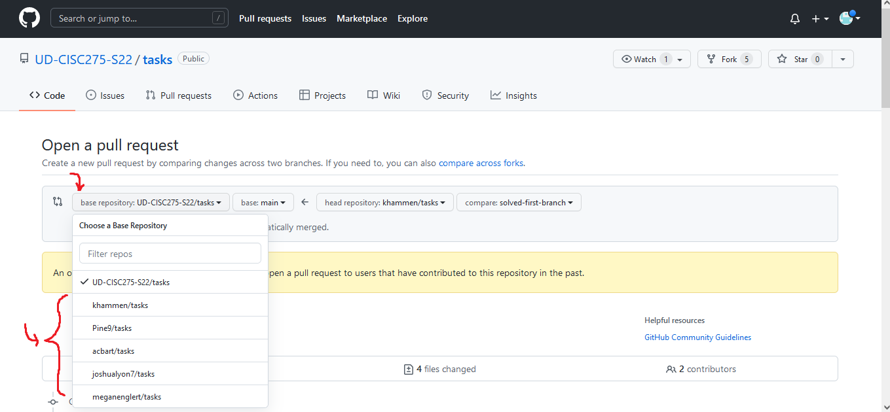

[&laquo; Return to Environment Setup](index.md)

<details open markdown="block">
  <summary>
    Table of contents
  </summary>
  {: .text-delta }
1. TOC
{:toc}
</details>

Our first task will be to add a little bit of new text to the site.

# Commits

We have previously mentioned that Git organizes projects into repositories, and that a repository is a history of commits. Each commit represents a bunch of changes to some files, with a human-friendly message and a machine-friendly hash attached. The message is written by a person to describe the changes. The hash was created by the machine to uniquely label the commit. These are important for referring to the commits. You can see the latest commits' messages and hashes with `git log`.

<!-- TODO: Get a picture here -->

# Branches

The history of commits is not linear. Instead, it is a graph, because at some points we want to **branch** off changes and work on them separately. The big advantage of this model is that we can work on new features for our application in isolation, without breaking the `main` branch (the special branch that most represents the stable codebase over time). You can branch off branches, and undo branches, and merge branches back into each other. It's a lot to learn all at once.

<!-- TODO: Get a picture here -->

We can use `git checkout` to switch to another branch, replacing the files that we see in the folder based on the commits in that branches history. We also use `git checkout -b` to create a new branch based on the current branch. We can combine changes from another branch with `git merge`.

# Remotes

One last thing to understand is the idea of Remote repositories. Right now, there are a bunch of copies of the same repository out there:

1. There is a local repository on your machine, in a folder
2. There is a remote repository on your Github representing your fork, which we will refer to as `origin`
3. There is the original remote repository on GitHub that you forked, which we will refer to as `upstream`

These three repositories can have a different set of branches and commits, but at any time you could tell them to coordinate with each other and get them back in sync (using `git pull` and `git push`). You won't be able to update our `upstream`, but you will frequently make the `origin` match your local repository.

<!-- TODO: Get a picture here -->

# 📝 Task - Create Your First Branch

Every time we start a new task, we will have you run the same general set of commands. Here are the commands we want you to run right now:

```sh
$> git pull upstream main
$> git fetch upstream task-first-branch
$> git checkout -b solved-first-branch
$> git merge upstream/task-first-branch
```

First, we are `pull`ing the latest versions of the `main` tasks branch from our upstream. If we have pushed any bug fixes to the main repository files, this will retrieve them.

Next, we `fetch` the latest version of the `task-first-branch`, which has a bunch of instructor-provided code to help us get started on the task. Normally, we would use `pull` since that it does a `fetch` and a `merge`, but we are going to do these separately so that we can put the files into a new branch with our solution.

Then, we have you `checkout` a new branch (the `-b` means create-branch-if-needed) that is named `solved-first-branch`, since this branch will contain our solution to the first task.

Finally, we `merge` in the upstream branch named `task-first-branch` which has those instructor-provided files we mentioned. Remember, at any given time, there are multiple repositories, each potentially with their own version of a given branch. So if you see things like `upstream/task-first-branch`, we're referring to the remote's version of that branch (which might not even have a local version). 

Depending on your operating system and command line setup, you may be asked to write a "commit message" when you try to `merge`. You can use the default message.

## The New Test

When we ran `git merge upstream/task-first-branch`, a new file appeared named `src/text.Test.tsx`. The file contains a single new Test; inspecting its contents will reveal that the test expects the text `"Hello World"` without quotes to be somewhere on the page.

You might want to see the test is failing by first running the command line tests. In Visual Studio Code, bring up a new terminal and enter:

```sh
$> npm run test:cov
```

You can quit by pressing the `q` on your keyboard.

Then, run the site:

```sh
$> npm run start
```

You are now ready to add the text `"Hello World"` somewhere. Up to you to decide, but we would probably suggest the body. Make sure you don't replace the text `"CISC275"` because the original tests will still look for those!

Once you have visually confirmed the text is there, you can use `CTRL+C` to cancel the `npm run start` command running in the termainal. Then, run the tests again:

```sh
$> npm run test:cov
```

If all tests pass, then you should be ready to make a Pull Request and deploy your change to the `main` branch.

## Make a Pull Request

Many folks feel that the best way to merge changes from a branch back into the `main` branch is to make a Pull Request on the remote repository. This forces you to show your code to your colleagues, which will be critical to working together in teams later on. Therefore, we are going to follow this model starting from here on, even though we are working alone.

The first time you push your changes for this branch, you will need to run the following command after you have added and committed your files:

```
$> git push --set-upstream origin solved-first-branch
```

This makes the local branch `solved-first-branch` available on the remote, and then pushes the branches' commits. You can now return to the repository on GitHub, where you will be presented with an orange box offering to make a Pull Request. This will let you merge the new branch into your `main` branch (thereby deploying your latest changes to the site). Click the button to get started.

The default base repository for your Pull Request is the original repository you forked (which belongs to us). You do not have permissions to make Pull Requests to the repository, nor do you want to. Instead, you will need to choose your own repository from the dropdown. Make sure you do not make a Pull Request to someone else, or you will be a nuisance to them!



Assuming you do not have any issues with your code, you can click through the menus and initiate the Pull Request. Once completed, the `main` branch is updated and should rebuild itself shortly. After a couple minutes, your changes should now be live on the deployed site.

Once you're done, we can start our [Basic Application &raquo;](../2-app/index.md)