# Environment Setup

[&laquo; Return to the Chapter Index](index.md)

<details open markdown="block">
  <summary>
    Table of contents
  </summary>
  {: .text-delta }
1. TOC
{:toc}
</details>

Making web applications is super complicated, so we are going to be really pushy about your environment's setup and the eventual structure of our web application. If this seems limiting, that's the idea.

Please try to stay within the bounds we give you, as you experiment and try things out!

Do not skip steps.

Read error messages, and ask questions. Talk to humans as needed to get help, and use google intelligently.


# Installations

There's a bunch of Software that you need on your machine. We aren't providing instructions for most of these. Seek help proactively.

1. [Install Git](https://github.com/git-guides/install-git): Make sure you have `git` on your path. You can test out `git` on your command line by running `git --version`
2. [Install Node](https://nodejs.org/en/download/): You can use the LTS version. You may need to reinstall Node if you do not have at least the LTS version. Make sure you have `node` on your path by running `npm --version`
3. [Install VS Code](https://code.visualstudio.com/download): This is an editor that you can open files and folders in.
4. Install React Devtools: This is a browser extension that will work on pages that have React running (like this one!). You only need one of these, for whichever browser you're using. We do most of our testing in Chrome, personally.
   1. [For Chrome](https://chrome.google.com/webstore/detail/react-developer-tools/fmkadmapgofadopljbjfkapdkoienihi?hl=en)
   2. [For FireFox](https://addons.mozilla.org/en-US/firefox/addon/react-devtools/)
5. Install the Prettier Plugin for VS Code using the menu shown below (last tab on the left, type in `prettier`, and then click `install`).

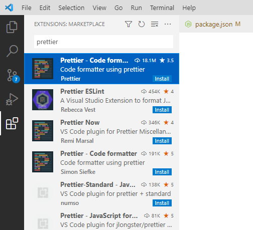

6. Install the `eslint` Plugin for VS Code using the same menu.

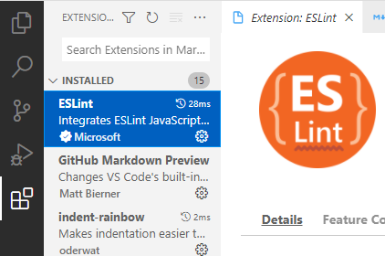

# Fork the Tasks

To accompany the material in this book, we have created a special GitHub repository full of tasks to complete.

Begin by forking the `tasks` repository to your GitHub account: <https://github.com/frontend-fun/tasks/fork>

## Enable Workflow Actions

You'll need to enable Workflow actions in your forked repository; go to the Actions tab, and then click the "I understand my workflows, go ahead and enable them". Assuming you trust us. The workflows will handle deploying your site and running your tests automatically.

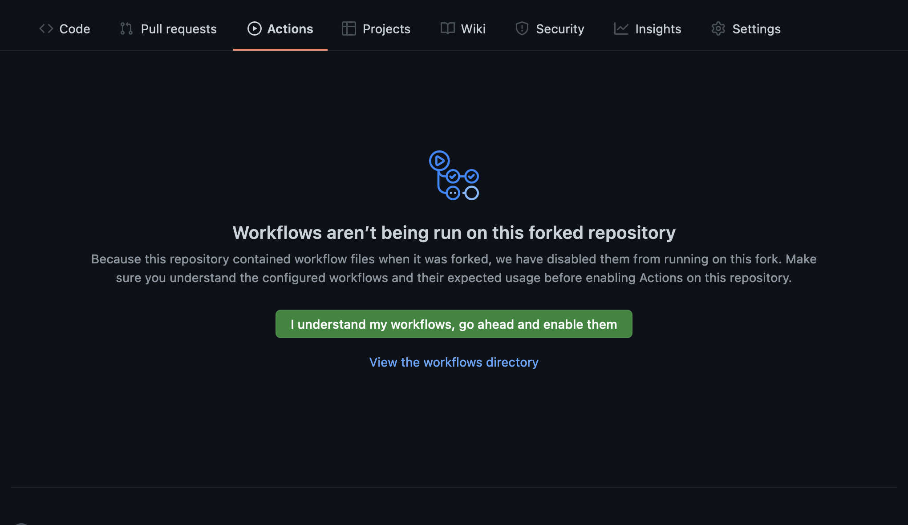

## Deploy from GitHub Actions

2. Next, you need to enable Github Pages for your repository. Go to the repository on Github, click on the "Settings" tab.

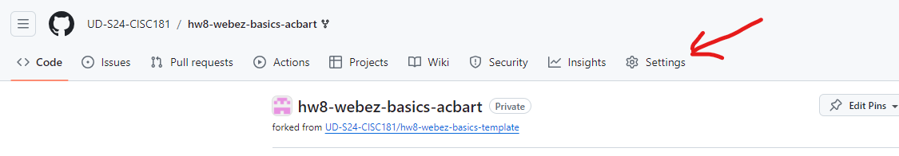

4. Scroll down to the "Github Pages" section. 

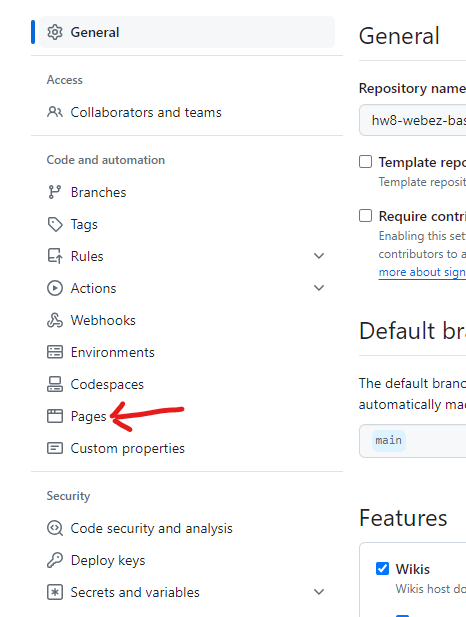

5. In the Source dropdown, select "GitHub Actions".

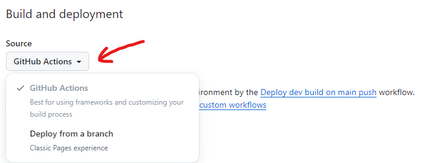

6. Go to the Actions tab and you should see a "workflow" running. This workflow will build and deploy your site to Github Pages. Once the workflow is complete, you should see a link to your site at the top of the page.

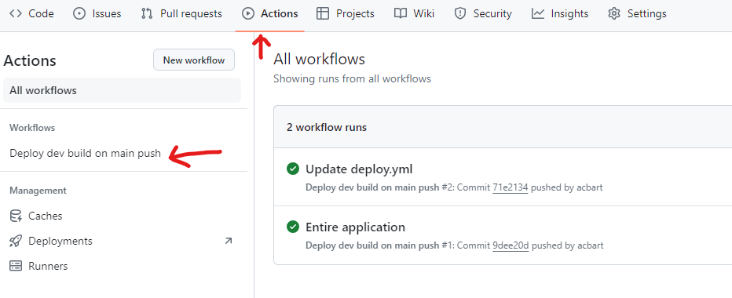

If the workflow doesn't seem to be running, click "Deploy dev build on main push" and then click "Run workflow". This will manually trigger the workflow to run, although you may have to reload the page to see it.

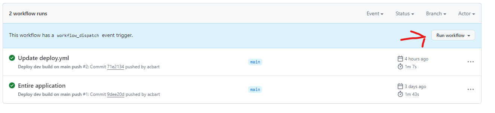

You can check the progress of a workflow by clicking on it:

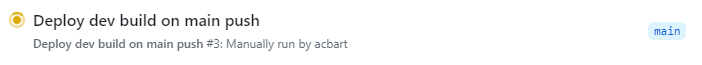

Click on the "deploy" button on the left sidebar to see the details of the deployment.

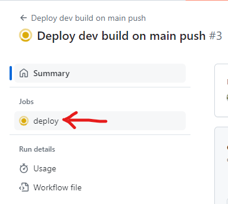

Assuming nothing goes wrong during deployment, the final step can be expanded to get the URL of your live site. Click on the URL to visit your site.

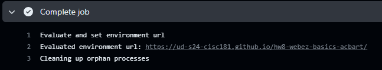

The site should now be able to deploy whenever you push a change to the `main` branch!

# Get the Tasks

Once the repository is forked and deployed, click the green button that says "<> Code", copy the URL, and use the command below to clone the repo and move into the cloned directory:

```sh
$> git clone https://WHATEVER-URL-YOU-GET
$> cd tasks
```

You'll need to add our original repository as an upstream remote, allowing you to pull in changes that we make along the way:

```sh
$> git remote add upstream https://github.com/frontend-fun/tasks.git
```

# Install Dependencies and Run

Now you need to install all the dependencies for the project, which will take a while:

```sh
$> npm install
```

Ignore warnings about vulnerabilities. They aren't as bad as they sound. If you were making a production application, you could deal with them, but this is just a first learning experience. But keep it in the back of your mind that security does matter and you have to learn that stuff eventually!

At this point, in theory, you should be able to run the starter application.

```sh
$> npm run start
```

After a minute or two, a web browser window will pop up, showing off the working website.

# Edit the Site

Open Visual Studio Code, and use the "File" -> "Open Folder" menu to open the repository directory.

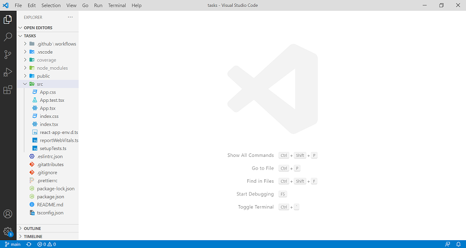

Edit `src/App.tsx` to include your name somewhere in the `return` statement, alongside the other text.

Save the file, and then check the website again in your browser. The site should update automatically.

Once you have visually confirmed the text is there, you can use `CTRL+C` to cancel the `npm run start` command running in the termainal, so you can run other commands. 

The next command to run is the tests, which will give another perspective on whether you are meeting our requirements:

```sh
$> npm run test:cov
```

So far, we only have one test, which checks to make sure that the text `CISC275` is in your website's content somewhere. If you ever decide to remove that text, remember to update that test case to check something similar.

# Deploying the Site

The window that appeared is showing your website running from a local webserver. You cannot share its link with other people, because that webserver is only available on your computer. Fortunately, we can *deploy* the web application through GitHub.

GitHub is a platform that lets us store copies of our code as it changes over time ("Version Control"), share that code with others, and even host simple websites. Projects are organized into repositories, and changes to the repository over time are organized into "commits". When you change your source code, you need to *commit* the changes and *push* them to the remote version of the repository.

Before you can make a commit, you must *stage* file any files that you want to include in the commit as being changed. You can quickly list files via the third menu on the left of Visual Studio Code, or using this terminal command:

```sh
$> git status
```

The only file we should have edited by now is `App.tsx`, so that will be listed. We need to *add* this file to the *stage* list, write a *commit* message, and then *push* the change. You can do this through the VS Code interface, or through the command line:

```sh
$> git add src/App.tsx
$> git commit -m "Added name to App"
$> git push
```

If all goes well, the changes will be pushed and you can go back to the remote repository in your browser (where you originally got the URL to clone the repository). Make sure you go to your fork, and not the original repository (since that one does not belong to you).

Within a minute or two of finishing, your site should deploy. You can access the page by going to the Environments page from the right sidebar menu.

If the site failed to build properly, there will be a Red X. Clicking the Red X will give you more details.

Otherwise, hopefully your changes will now be live on the website. You might need to do a hard-refresh.

At this point in time, your setup is done.

Let's try the first REAL task: [Branching Out &raquo;](../1-setup/branching.md)