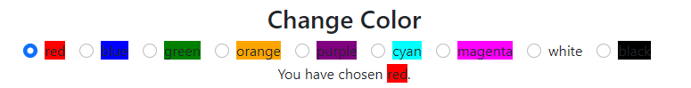

# Forms

[&laquo; Return to Components](components.md)

<details open markdown="block">
  <summary>
    Table of contents
  </summary>
  {: .text-delta }
1. TOC
{:toc}
</details>

# What are Forms?

State (the Model) is a critical part of a web application, but so are the View and the Control. Forms are one of the primary ways to expose the State in the View, and to also provide Control to the user to modify the State. Forms have a rich history in web development, extending back almost to the very beginning of HTML. They existed prior to all the fancy JavaScript features, and are a fundamental part of most web experiences.

Essentially, a "Form" is a collection of specialized user interface elements. You are probably used to seeing many of these elements all the time: text boxes, checkboxes, radio buttons, drop down menus, file upload buttons, and so much more. These elements are sometimes referred to as "Widgets".

Bootstrap is a very popular library for styling web pages, and provides a ton of helpful CSS rules for making forms look decent without much developer effort. The React Bootstrap libraries builds on the two underlying technologies (React and Bootstrap) to provide Components that make building Forms much more pleasant and effective. You can see a lot more information about Bootstrap and its Forms here: <https://react-bootstrap.github.io/forms/overview/>


## Form Groups

Technically, most user input components correspond to a single underlying HTML tag: there's `input`, `textarea`, and occasionally more complicated ones like the `select` dropdown. However, on their own, these inputs do not provide a very nice user experience since they will not be labelled and laying them out correctly is tricky. Therefore, when using React Bootstrap, you will organize most components in a `Form.Group` which will have several other tags such as a `Form.Control` (the actual input component), a `Form.Label` (a human-friendly identifier visible to the user), and a `Form.Text` (a longer, more subtley-rendered note adjacent to the form).

```tsx
function App(): JSX.Element {
    return <Form.Group className="mb-3" controlId="formBasicEmail">
        <Form.Label>Email address</Form.Label>
        <Form.Control type="email" placeholder="Enter email" />
        <Form.Text className="text-muted">
            We'll never share your email with anyone else.
        </Form.Text>
    </Form.Group>
}
```

Notice the `controlId` parameter we have included in the form above. This improves the accessibility of the form for folks using Screen Readers and other automated tools. You should always keep these kinds of users' experience in mind!

You will sometimes see widgets surrounded by a `Form` tag, but we recommend against using a `Form` tag for now. This tag makes the widgets behave as a full HTML Form, which has a lot of additional functionality that you probably do not want at this point in time. 

## Form Attributes

All of these components provided by Bootstrap have MANY attributes available to control their behavior. Some attributes are fairly universal: the `disabled` attribute is available on most input forms. Some are more specialized, like the `placeholder` attribute for text boxes. However, they all work in the same way that we have seen attributes as before: you can specify them with either string literals with double quotes or embedded TypeScript with curly braces:

```tsx
let canEdit = true;
// This example will not run; it's just demonstrating the syntax
<Form.Control type="email" placeholder="Enter Email" disabled={canEdit}>
```

## Form Values

Almost every single component of a Form has a `value` that represents its current value. From JavaScript's perspective of the DOM, this is literally an attribute that you can lookup and use in your code. From the HTML perspective, this is often an attribute you can specify when creating the element. Not every form element uses `value`, but most do.

# Events

One of the most important aspects of a user interfaces is responding to user interaction. JavaScript and HTML have developed a sophisticated "Event System" that let's developers bind HTML actions (like clicking a button, or typing into an input box) to JavaScript functions. React builds on this existing infrastructure, with basically the same concept. Of course, in many places, React will change names slightly; TypeScript adds further complications you may have to provide types.

When you google for help with Forms, you must pay close attention to whether the advice is appropriate for the technology stack you are using (which in this case, is React Hooks, TypeScript, and React Bootstrap). You will often find advice that suggests workable solutions which are wrong for your technology stack. Just because you *can* make the code you find works, doesn't mean that it's a good idea. Jamming different libraries and approaches together leads to confusing, fragile code. It is very likely that you will need to fix that code later on ("Technical Debt" has accrued), that small subtle errors will manifest sporadically, or you'll have issues with performance.

However, fundamentally for now, the important thing to remember is that React gives us a way to bind *Callback Functions* to different *Events*.

## Callback Functions

We have already seen `onClick` events, which are quite simple. A button is clicked, and a function is executed. The function to be executed is sometimes referred to as a "Callback Function". That function must be given as a *reference* instead of being called directly: syntactically, that means writing the name of the function *without* parentheses (`name` instead of `name()`).

```tsx
function App(): JSX.Element {
  function clickCallback() {
    console.log("I was clicked!")
  }
  return <Button onClick={clickCallback}>Click me!</Button>
}
```

You can also provide the function inline using the lambda syntax. This is sometimes known as an "Anonymous Function" since you do not specify the function's name. Why would you, if you were only going to use that function in this one specific circumstance? An anonymous function is often concise, but might be inappropriate if the function to be executed becomes complicated. Still, if the function is short, they are often used instead; it's really developer preference most of the time.

```tsx
function App(): JSX.Element {
  return <Button onClick={() => console.log("I was clicked!")}>Click me!</Button>
}
```

## `onChange` and Other Events

The `onClick` event is simple; it happens when you put your mouse on top of some visible HTML and press one of the mouse buttons. The behavior is very consistent across HTML elements - and in fact, you can use `onClick` with any HTML element (e.g., `div`, `span`, `h1`) that takes up space. When we activate an event, we say that the event has "Fired".

Another event you will see instead of `onClick` is the `onChange` event. This one is a little more complicated, because the way it works varies heavily depending on the HTML Element. In fact, not every element supports the `onChange` event. As we will see, it's mostly just the forms. There's no concept of a `div` tag having an `onChange` event, the way there is for an input textbox. Buttons don't have `onChange` either!

There are many, many other events available. You are unlikely to encounter many of them at first, since some are very esoteric. But some examples are:

* `onFocus`: Fires when an element is given focus - such as clicking into a textbox, or tabbing onto a link. The corresponding event for losing focus is `onBlur`
* `onMouseOver`: Fires when the mouse cursor is placed on top of the element. There are other variations for when the mouse cursor leaves, or moves while on top of the element.
* `onDrag`: Fires when an element is clicked and dragged somewhere.
* `onLoad`: Fires when an Image element finishes loading. There is also `onError` for if it fails to load correctly.

## Event Parameters

Even within a type of event (e.g., `onClick` or `onChange`) there are a lot of variations. Did the user click the left mouse button, or the right mouse button? Did the user enter `H` into the input textbox, or did they press the `Enter` key? JavaScript's Event System provides information about the specifics of the event via a parameter to its bound callback function. This event is a complex object which has event details and also information about the "target" of the event (aka, the HTML element involved).

The most important event that we will see frequently is the `React.ChangeEvent`, which is fired by the `onChange` event. This event is a *Generic* event type, getting fired for input boxes, text areas, and drop-down boxes ("Select" boxes). You have seen generics when dealing with `useState`, which required you to indicate the element type in angle brackets (e.g., `useState<number>()`). When using `React.ChangeEvent`, we narrow the specific kind of element involved using angle brackets again (using values like `HTMLInputElement`, `HTMLTextAreaElement`, or `HTMLSelectElement`):

```tsx
function textboxCallback(event: React.ChangeEvent<HTMLInputElement>) => {
  // `event.target` is the actual HTML element that is changing
  // That element has an attribute named `value` containing its new text
  console.log(event.target.value);
};
```

As an alternative to providing the parameter type to the callback function, you can instead provide the type of the entire function:

```tsx
const textboxCallback: React.ChangeEventHandler<HTMLInputElement> = (event) => {
  console.log(event.target.value);
};
```

You will often see the `event` parameter abbreviated as `e` or `evt`. This is a developer's choice: you must balance the virtue of brevity with the virtue of clarity.

Continually typing `React.ChangeEvent<HTMLInputElement>` is a little inconvenient, so we will often rely on a type declaration to simplify our code. Whether you choose to use such a shortcut is again a developer's choice. However, we particularly like this snippet because it allows you to use `ChangeEvent` for either single line input boxes or multiline text areas.

```tsx
type ChangeEvent = React.ChangeEvent<HTMLTextAreaElement | HTMLInputElement>;
```

Still, this isn't perfect. If the code depends on an attribute available in one of the two types but not the other, TypeScript will be confused and not recognize the attribute. So you may need to be careful when choosing an appropriate type parameter.


# Specific Components

Now that we have the theory of Bootstrap's Forms and React's HTML events and TypeScript's callbacks, let's take a look at how these components behave in isolated practice. In a later chapter, we will see how they can be combined together to make truly complicated applications!

## Textbox

After the button, the Textbox is probably one of the most fundamental types of user input elements we will use. As its name implies, the textbox lets a user enter text. To create a textbox, we will place a `Form.Control` with the attribute `type="text"` inside of a `Form.Group` and alongside a `Form.Label`.

The two critical fields that tie the `Form.Control` component to the application's State are the `value` and `onChange` fields. The `value` is text that will be shown in the box when the component is rendered. The `onChange` is the callback function that will call a State Setter to update the current state, triggering a new render of the Component with an updated state.

```tsx
export function App(): JSX.Element {
  // This is the State (Model)
  const [name, setName] = useState<string>('Alien');

  // This is the Control
  function updateName(event: React.ChangeEvent<HTMLInputElement>) {
    setName(event.target.value)
  }

  // This is the View
  return <div>
    <Form.Group controlId="formMovieName">
      <Form.Label>Name:</Form.Label>
      <Form.Control
        value={name}
        onChange={updateName} />
    </Form.Group>
    <div>
      The movie is "{name}".
    </div>
  </div>;
}
```

Let us break down the exact flow more slowly, to develop a mental conception of React's Forms:

1. When the `App` component is initially rendered, the `'Alien'` value is attached to the first hook and `2022` is attached to the second hook.
2. The values of `name` and `released` (the first two hooks) are accessed and used to render the two form components' initial states.
3. The user now sees the application. They can type into the `Name:` box, perhaps the letter `s`.
4. Typing into the box fires the `onChange` event for that component, which means the corresponding callback function `updateName` is called.
5. The callback function calls `setName` using the `event.target.value` (which is the new current value of the box, which is `Aliens`).
6. The first hook is updated, which triggers React to re-render the `App` component that contains the hook.
7. This time, the first hook is given the value of `Aliens` instead of `Alien` since the component has been rendered before.
8. When the `Name:` box component is rendered, the value shown via `name` is `Aliens`.

Steps 4 through 8 will recur every time the user types something into the box.

This may seem a little complicated for such a simple idea: we just want the user to be able to type text to update the State! Know that there are many alternative ways that this could have been developed. In fact, even within React, there are alternatives known as ["Uncontrolled Components"](https://reactjs.org/docs/uncontrolled-components.html). However, the model we are showing you here ("Controlled Components") is the dominant one for using React Hooks and will serve us in creating applications. The trick is just to keep the mental model straight!

### Number Input Box

A small variation on the Textbox is the number box. The only real change is that the HTML element will enforce the user to enter a number, although technically it is up to the browser to decide how to render things differently. For example, mobile phones will often switch keyboard layout for a Number Input Box.

The type of data stored in the value field is still a string, like with a `text` field. Therefore, we must parse the user's text and handle the case where the user manages to enter something that is not a number (e.g., an empty string). There are two ways to handle this: you can try to update the state to always be a number (which prevents us from having reasonable inputs like the empty string `""`), or you can use a calculated value based on the current state. We used `|| 0` to provide a default value if the text is unparseable; you might also use a ternary or provide some specific text string (e.g., `"error"`).

```tsx
export function App(): JSX.Element {
  const [released, setReleased] = useState<string>("2022");
  const previousYear = (parseInt(released)-1) || 0;

  // Provide forms for editing the new movie
  // And also a button to append the movie
  return <div>
    <Form.Group controlId="formMovieReleased">
      <Form.Label>Released:</Form.Label>
      <Form.Control
        type="number"
        value={released}
        onChange={(event: React.ChangeEvent<HTMLInputElement>) =>
          setReleased(event.target.value)}
      />
    </Form.Group>
    <div>
      The year before the movie was released was {previousYear}.
    </div>
  </div>;
}
```

### Horizontal Layout

Frequently, you want to have a horizontal layout for your forms. This requires changing around the TSX a little bit. For the textboxes above, for example, we had to do the following:

* Add the `as={Row}` attribute to the `Form.Group` tag
* Add `column` and `sm={2}` attributes to the `Form.Label` tag
* Surround the `Form.Control` with a new `Col` tag

You can learn more about Horizontal Layouts (and other layout options) here: <https://react-bootstrap.github.io/forms/layout/#horizontal-form>

```tsx
export function App(): JSX.Element {
  // These will be the values for the new Movie
  const [name, setName] = useState<string>('New Movie');
  const [released, setReleased] = useState<number>(2022);

  // Provide forms for editing the new movie
  // And also a button to append the movie
  return <div>
    <Form.Group controlId="formMovieName" as={Row} >
      <Form.Label column sm={2}>Name:</Form.Label>
      <Col>
        <Form.Control
          value={name}
          onChange={(event: React.ChangeEvent<HTMLInputElement>) =>
            setName(event.target.value)} />
      </Col>
    </Form.Group>
    <Form.Group controlId="formMovieReleased" as={Row}>
      <Form.Label column sm={2}>Released:</Form.Label>
      <Col><Form.Control type="number" value={released}
        onChange={(event: React.ChangeEvent<HTMLInputElement>) =>
          setReleased(event.target.value)} />
      </Col>
    </Form.Group>
    <div>
      The movie {name} was released in {released}.
    </div>
  </div>;
}
```

### Multiline Textarea

The text box is only good for a single line. If you want multiple lines, then you want a Text area, by adding a new attribute `as="textarea"`:


```tsx
export function App(): JSX.Element {
  // This is the State (Model)
  const [description, setDescription] = useState<string>('What can you tell me?');

  // This is the Control
  function updateDescription(event: React.ChangeEvent<HTMLTextAreaElement>) {
    setDescription(event.target.value)
  }

  // This is the View
  return <div>
    <Form.Group controlId="formMovieName">
      <Form.Label>Name:</Form.Label>
      <Form.Control
        as="textarea"
        rows={3}
        value={description}
        onChange={updateDescription} />
    </Form.Group>
    <div>
      Your description is {description.length} characters.
    </div>
  </div>;
}
```

## Checkbox

The next kind of Form we will look at is a checkbox. This corresponds to some boolean State, either checked or unchecked. The attribute is `checked` instead of `value`, confusingly. Notice we no longer need a separate `Form.Group`, `Form.Input`, or `Form.Label` for this component; instead we use a special `Form.Check`. We provide a `label` as an attribute, and we should also provide an `id` to help with screenreaders. A good `id` will just be a unique internal label that the user doesn't see, but the `label` is visible to the user!

```tsx
export function App(): JSX.Element {
  // This is the State (Model)
  const [isHappy, setIsHappy] = useState<boolean>(true);

  // This is the Control
  function updateHappiness(event: React.ChangeEvent<HTMLInputElement>) {
    setIsHappy(event.target.checked)
  }

  // This is the View
  return <div>
      <Form.Check
          type="checkbox"
          id="is-happy-check"
          label="Happy?"
          checked={isHappy}
          onChange={updateHappiness}
      />
      <div>The user is {isHappy ? "happy" : "not happy"}.</div>
  </div>;
}
```

### Switch

The switch is essentially a visual modification of the checkbox, so it's not really that different.

```tsx
export function App(): JSX.Element {
  // This is the State (Model)
  const [isHappy, setIsHappy] = useState<boolean>(true);

  // This is the Control
  function updateHappiness(event: React.ChangeEvent<HTMLInputElement>) {
    setIsHappy(event.target.checked)
  }

  // This is the View
  return <div>
      <Form.Check
          type="switch"
          id="is-happy-check"
          label="Happy?"
          checked={isHappy}
          onChange={updateHappiness}
      />
      <div>The user is {isHappy ? "happy" : "not happy"}.</div>
  </div>;
}
```

### Radio Buttons

On the other hand, radio buttons are more complicated since they represent a set of choices. In React Bootstrap, we create them by having multiple `Form.Check` elements working together.
Instead of a boolean State, we are now facing a string State (or at least, some subset of strings). In order to tell React to handle the Radio Group as a single cohesive unit, we need to provide a `name` attribute that is common across the Radio Buttons.

We must also dramatically change how we provide `checked`, using a calculated expression based on the state (in order to turn the string state into a boolean value). We also provide a `value` attribute again, which simplifies our callback for `onChange` (since we can just unconditionally update the state the same way for each component).

```tsx
export function App(): JSX.Element {
  // This is the State (Model)
    const [emotion, setEmotion] = useState<string>("happy");

    // This is the Control
    function updateEmotion(event: React.ChangeEvent<HTMLInputElement>) {
        setEmotion(event.target.value);
    }

    // This is the View
    return (
        <div>
            <Form.Check
                type="radio"
                name="emotions"
                onChange={updateEmotion}
                id="emotion-check-happy"
                label="Happy"
                value="happy"
                checked={emotion === "happy"}
            />
            <Form.Check
                type="radio"
                name="emotions"
                onChange={updateEmotion}
                id="emotion-check-sad"
                label="Sad"
                value="sad"
                checked={emotion === "sad"}
            />
            <Form.Check
                type="radio"
                name="emotions"
                onChange={updateEmotion}
                id="emotion-check-angry"
                label="Angry"
                value="angry"
                checked={emotion === "angry"}
            />
            <div>The user is feeling {emotion}.</div>
        </div>
    );
}
```

If you add the `inline` attribute to the `<Form.Check>` tag, you can make put the radio buttons all on the same row.

```tsx
export function App(): JSX.Element {
    const [response, setResponse] = useState<string>("good");

    return (
        <div>
            <Form.Check
                inline
                type="radio"
                name="response"
                onChange={(e) => setResponse(e.target.value)}
                id="response-good"
                label="😃"
                value="good"
                checked={response === "good"}
            />
            <Form.Check
                inline
                type="radio"
                name="response"
                onChange={(e) => setResponse(e.target.value)}
                id="response-bad"
                label="😒"
                value="bad"
                checked={response === "bad"}
            />
            <div>The response is {response === "good" ? "😃" : "😒"}.</div>
        </div>
    );
}
```

### Multi-Checkbox

Radio buttons are mutually exclusive, but what if you want to have a bunch of options and the user can select any one of them? This means that we have some state that is really a list.

```tsx
export function App(): JSX.Element {
  // This is the State (Model)
    const [emotions, setEmotions] = useState<string[]>(["happy", "sad"]);

    // This is the Control
    function updateEmotion(event: React.ChangeEvent<HTMLInputElement>) {
        const emotion = event.target.value;
        // Check if the emotion is already present
        if (emotions.includes(emotion)) {
            // Remove the given value
            setEmotions(emotions.filter((e) => e !== emotion));
        } else {
            // Append the given value
            setEmotions([...emotions, emotion]);
        }
    }

    // This is the View
    return (
        <div>
            <Form.Check
                type="checkbox"
                id="emotion-check-happy"
                label="Happy"
                name="emotions"
                value="happy"
                checked={emotions.includes("happy")}
                onChange={updateEmotion}
            />
            <Form.Check
                type="checkbox"
                id="emotion-check-sad"
                label="Sad"
                name="emotions"
                value="sad"
                checked={emotions.includes("sad")}
                onChange={updateEmotion}
            />
            <Form.Check
                type="checkbox"
                id="emotion-check-angry"
                label="Angry"
                name="emotions"
                value="angry"
                checked={emotions.includes("angry")}
                onChange={updateEmotion}
            />
            <div>The user is feeling {emotions.join(" and ")}.</div>
        </div>
    );
}
```

## Dropdown/Combobox/Select Menu

Select menus (also known as Dropdown menus or Comboboxes) are very popular. They are structured a little bit like a combination of the other two types, representing a string state (or subset of strings) with a `Form.Select` tag. They still have the single `value` and `onChange` attributes, but they also must have a bunch of `option` tags inside with their own `value` attributes.

```tsx
export function App(): JSX.Element {
    // This is the State (Model)
    const [emotion, setEmotion] = useState<string>("happy");

    // This is the Control
    function updateEmotion(event: React.ChangeEvent<HTMLSelectElement>) {
        setEmotion(event.target.value);
    }

    // This is the View
    return (
        <div>
            <Form.Group controlId="userEmotions">
                <Form.Label>How do you feel?</Form.Label>
                <Form.Select value={emotion} onChange={updateEmotion}>
                    <option value="happy">Happy</option>
                    <option value="sad">Sad</option>
                    <option value="angry">Angry</option>
                </Form.Select>
            </Form.Group>
            The user is feeling {emotion}.
        </div>
    );
}
```

### List of Options

A very frequent situation is to have a Select menu that is populated by a list of options. This requires that you provide a unique `key` attribute, or else you will get subtle errors. But otherwise, you just generate all of the `option` tags from a `.map()` over an array.

```tsx
const COLORS = ["red", "blue", "green", "orange", "purple", "yellow"];
const DEFAULT_COLOR = COLORS[0];

export function App(): JSX.Element {
    // This is the State (Model)
    const [favorite, setFavorite] = useState<string>(DEFAULT_COLOR);

    // This is the Control
    function updateFavorite(event: React.ChangeEvent<HTMLSelectElement>) {
        setFavorite(event.target.value);
    }

    // This is the View
    return (
        <div>
            <Form.Group controlId="favoriteColors">
                <Form.Label>What is your favorite color?</Form.Label>
                <Form.Select value={favorite} onChange={updateFavorite}>
                  { COLORS.map((color: string) =>
                    <option key={color} value={color}>{color}</option>
                  )}
                </Form.Select>
            </Form.Group>
            The user's favorite color is {favorite}.
        </div>
    );
}
```

# Testing Forms

With more sophisticated kinds of user input, we must also now have more sophisticated kinds of testing. We're going to need more ways to access the screen, and also new ways to simulate user input.

## New Ways to Access the Screen

First, we'll introduce two new suffixes (`LabelText` for checking labels and `DisplayValue`). The `LabelText` suffix allows us to find elements based on their `Form.Label`; we access the actual interactive component rather than the Label itself (i.e., you'd get an input box or select instead of the label). The `DisplayValue` checks the current value entered into the input element.

|              | getBy             | queryBy             |
|--------------|-------------------|---------------------|
| Text         | getByText         | queryByText         |
| Role         | getByRole         | queryByRole         |
| TestId       | getByTestId       | queryByTestId       |
| LabelText    | getByLabelText    | queryByLabelText    |
| DisplayValue | getByDisplayValue | queryByDisplayValue |

We'll also introduce a variation on our existing prefixes which will let us get `All` matching elements. The `getAllBy` variant expects 1 or more elements, while the `queryAll` allows 0, 1, or more elements. The end result is a list, which you will probably need to filter further in order to do anything interesting.

|              | getAllBy             | queryAllBy             |
|--------------|----------------------|------------------------|
| Text         | getAllByText         | queryAllByText         |
| Role         | getAllByRole         | queryAllByRole         |
| TestId       | getAllByTestId       | queryAllByTestId       |
| LabelText    | getAllByLabelText    | queryAllByLabelText    |
| DisplayValue | getAllByDisplayValue | queryAllByDisplayValue |

This list is still not exhaustive. There are still a bunch of other suffixes, which we will be unlikely to use:

* `ByPlaceholderText` find by input placeholder value
* `ByAltText` find by img alt attribute
* `ByTitle` find by title attribute or svg title tag

There are also the `findBy` and `findAllBy` prefixes, which support asynchronous interaction. We will cover that in a future version of the Tome, but for now hope that you won't need them.

<!--
### No Labels

"But what if my component doesn't have a label, how can I access it?"

Just give your component a label. It makes it more accessible.

If you can't do that, then you can fall back to the `aria-label` attribute.

Your worst case scenario is using the `data-testid` attribute, which you hate to see.
-->

## New Assertions

We'll add a new assertion to our list of tools too. 

* `toHaveValue(value)` assertion will check an input element to make sure it has a given value. Keep in mind that the value will most likely be a string, since it comes from HTML and not JavaScript.
* `toBeChecked()` assertion will make sure a textbox or radio has a check (is true).

## New Ways to Simulate User Input

The `.click()` method has served well so far to simulate the user clicking something, but now we also have input boxes where the user can type. The interface we use comes from the handy `@testing-library/user-event` package, which provides a function named `.type()`. Let's look at an example where we have an Input Box with the label `Name:` next to it and the initial text is `Alien`.

```tsx
// This testing example does not run in the browser!
const nameElement = screen.getByLabelText(/Name:/i);
userEvent.type(nameElement, "s the Movie");
expect(nameElement).toHaveValue("Aliens the Movie");
```

There is also the `.selectOptions()` function for targetting dropdowns. There are many other ways to simulate user input, depending on what kinds of forms you are dealing with. We won't get into any more details, but expect to have to use the resources we have pointed to before:

* Here is an article on the [React Testing Library](
https://www.robinwieruch.de/react-testing-library/).
* Here is a [React Testing Library Cheat Sheet](https://testing-library.com/docs/react-testing-library/cheatsheet/).

# 📝 Task - Making Forms

As always, begin by pulling our changes, making a new branch, and merging in our changes. This time, be sure that you create your new branch from the previous branch we worked on (`solved-components`) by checking out that branch first.

```sh
$> git checkout solved-components
$> git pull upstream main
$> git fetch upstream task-forms
$> git checkout -b solved-forms
$> git merge upstream/task-forms
```
You may encounter merge errors once again. If so, then you need to resolve the conflicts, stage the files, and then commit your changes BEFORE you start working on the components. Here is a [tutorial on merging conflicts](https://docs.github.com/en/pull-requests/collaborating-with-pull-requests/addressing-merge-conflicts/resolving-a-merge-conflict-using-the-command-line) if you are still struggling.

## Creating Components

Once again, you are going to create 5 new components. We have provided you with the skeleton of all 5 components and extensive tests for each component. We have also added them to the `App` component, separated by horizontal rules (`hr` HTML tags). Note that you must follow all of our instructions and requirements!

You are going to need to edit the components themselves and include them in your `App` component. Remember that you can view your website locally by running it with:

```sh
$> npm run start
```

Every time you save a file in VS Code, the website should update automatically while this command is running!

## CheckAnswer

The `CheckAnswer` component allows a user to enter an answer to a short answer question, and then displays whether they got it correct or incorrect. The component takes in a parameter representing the `expectedAnswer`.

* You will need a state to handle the user's given answer
* The user's given answer should initially be the empty string
* When the user's given answer matches the `expectedAnswer`, display ✔️; otherwise display ❌

## GiveAttempts

The `GiveAttempts` component simulates a user taking a quiz with a limited number of attempts, but also provides a way for them to gain as many attempts as they want via a numeric input box.

* You will need a state to represent the number of attempts the user has left, and another state to represent the number of attempts they are requesting.
* The initial number of attempts left should be 3.
* The number of attempts left should be visible.
* There should be a numeric input box where the user can specify their requested number of attempts.
* There should be two buttons, one labeled `use` that decreases the attempts by one and one labeled `gain` that increases the attempts by the amount in the input box.
* If the user attempts to request an invalid amount (e.g., the empty string `""`) that cannot be parsed as an integer, then do not change their number of attempts.
* When the user is out of attempts, the `use` button should be disabled

## EditMode

The `EditMode` component has two states controlled by a switch: the default state shows text indiciating the user's name and whether they are a student, and then the alternate state is an editable form for editing the user's name and whether they are a student.

* You will need state to handle the component being in "edit mode", the user's name, and whether or not the user is a student.
* Initially, the component is NOT in edit mode, the user's name is literally the string `Your Name` (as in, that exact string, not your actual name), and the user IS a student.
* When not in edit mode, the text of the component must include `Your Name is a student` or `Your Name is not a student`.
* As another example, if the user entered their name as `Charles Babbage` and said they were NOT a student, then the text would be `Charles Babbage is not a student`.

## ChangeColor

The `ChangeColor` component offers the user a bunch of radio buttons labeled with different colors; choosing a radio button updates the text and color of a nearby box of text.

* You will need state to represent the chosen color
* You are free to make up your own list of colors, but you must have AT LEAST 8 unique colors. 
* Each color must be represented by a radio button.
* There should be a box of text with a `data-testid="colored-box"` attribute and value.
* The box of text should have the same text and `backgroundColor` style as the currently selected radio button.

HINT: We strongly recommend you use `map` to render all the color's `Form.Check` tags rather than hardcoding each one!

HINT: We recommend you use the `inline` attribute for the radio buttons.



## MultipleChoiceQuestions

The `MultipleChoiceQuestions` component allows a user to select an answer from a list in a dropdown, and then displays whether they got it correct or incorrect. The component takes in a parameter representing the `expectedAnswer` and also a parameter representing the list of `options`.

* You will need a state to represent the user's currently selected choice.
* The initial state of the selected choice is the first element of the `options` list.
* When the user's given answer matches the `expectedAnswer`, display ✔️; otherwise display ❌

## Testing and Deploying

Check your status with the tests by running:

```sh
$> npm run test:cov
```

If you are overwhelmed by the number of failing tests, you can focus on just one at a time by typing `p` and entering the name of the file you want to test (e.g., `ChangeColor.test.tsx`). You can go back to running all the tests by typing `a`.

As you complete components, use the `git add`/`git commit` or the Visual Studio Code interface to make small regular commits. Practice the habit now!

Once you are passing all the tests, you should be able to push your branch to the remote and make a Pull Request to `main`. We'll be checking your tests to make sure you pass!

```sh
$> git push --set-upstream origin solved-forms
```

Once you're done submitting, you are ready to move onto the next chapter, we make a [Complex Application &raquo;](../5-complex/index.md)