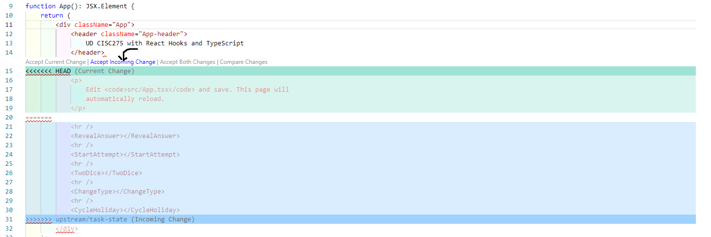

# State

[&laquo; Return to the Chapter Index](index.md)

<details open markdown="block">
  <summary>
    Table of contents
  </summary>
  {: .text-delta }
1. TOC
{:toc}
</details>

JavaScript and TypeScript are not interesting because they let us do basic calculations and render static HTML. They are cool because they let us control web pages and make things dynamic and interactive. So let's do that now instead.

# A State-less Component

Let us look at a very simplistic application that has no state:

```tsx
export function App(): JSX.Element {
  // Boring!
  return <div>Hello World</div>
}
```

There are no buttons, input boxes, or other mechanisms to let us interact with the application, because there is no State to get or set. We just return a constant value. If there was a button, clicking it could not mess with the "Hello World" text. We need State in order to do fun interactive stuff.

# Interactivity

Interactivity means that a page changes when you interact with the page. That means a page has a BEFORE and an AFTER. At any given point in time, you can check the "State" of the page. Think of watching a movie where you hit the play button, and then you advance one frame forward. How has the "state" of the world changed?

<!-- TODO: Image of a BEFORE and AFTER state for an application -->

Every application you have ever used or created has some kind of state. State is fundamental to a program. All those fancy control structures like `if` and `for` are all in service to the idea of *getting* and *updating* state. Here are some examples of State in applications:

* The current number displayed in a calculator
* A list of activities in a Todo application
* A collection of dates mapped to activities in a Calendar application
* Whether or not a checkbox is checked in a form
* What song is currently playing in a music player
* Where an avatar is on the screen in a video game

We represent State with *values*, and describe the possible sets of State with *types*. Often, State ends up being stored in *variables* temporarily, since those variables' values can change over time to reflect changes in State.

When you build an application, you need to think of the State first. Often, this means describing the State in terms of types and data structures. React is built around the idea of "one-way" State updates.

# Model, View, and Controller

One of the most common architectural patterns in Software Engineering is the idea of "Model-View-Controller".

* Model is the State, describing what possible values your State can live in. It needs to be *persistent*.
* View is the parts of your application's logic that let you show off the current State.
* Controller is the parts of your application's logic that let you change the current State.

Most folks recommend trying to keep your Model, View, and Controller relatively distinct from each other. "How" to do this varies among frameworks and languages, but we're going to focus on React's model, which is called One-way Data Binding.

<!-- TODO: Image of React's One-way Data Binding architecture -->

React is organized into Components, and each Component has its own State. The main Component is called `App` and its State is the most important one. We will see later how we can have more components with their own State. For now, when we talk about State, we are talking about the State of `App`. That State is our **Model**.

A Component Function, by definition, returns JSX (aka HTML). This is the **View**. That View can use the current values of the State.

The View can also bind *events* to *functions*, so that when a user interacts with the View (e.g., clicking a button, typing into an input box), an inner function can be fired that modifies the Model. We call those inner functions the **Controllers**. 

When the Controllers update the Model, React automatically knows to re-render the View by calling the Component Function again. The State updates happen in one big circular direction - The Controller modifies the Model, the Model tells the View to update, and the View provides mechanisms for the Controller to activate.

# A Component with State

So what does this mean in practice? Let's take a look at a Component that does have State:

```tsx
function App(): JSX.Element {
  const [counter, setCounter] = useState<number>(0);

  function addOne(): void {
    setCounter(counter+1);
  }
  
  return <Button onClick={addOne}>{counter}</Button>;
}
```

Run this application and click the button. Every time you click, the counter should increase by one. That single number in `counter` represents the Model of the application. The `addOne` logic represents the Controller, and the returned `Button` is the View.

But what on earth is happening in that second line with the `const [counter, setCounter] = ...`?

# The useState concept

Let's take a look at that most important line, with the `useState`.

```tsx
const [state, setState] = useState<number>(initialValue);
```

On its own outside of `App`, this line won't run. Not only because we haven't defined `initialValue`, but also because the Rules of Hooks: 

1. You must always call `useState` within a Component Function (like `App`).
2. Do not put `useState` inside of loops, conditionals, or other functions.

Before we dive into a proper example, let's get some terminology about that line of code, because we're going to see A LOT of it.

## Terminology

Memorize these terms

* `state` is the "State Variable", representing our current Model. We control its name. What is its name in the app above?
* `setState` is the "State Setter Function", giving us a low-level Controller to modify our Model. We control its name. What is its name in the app above?
* `useState` is the "Hook Creation Function", giving us a "Hook" to store our Model in. It returns the State and the State Setter. This name is always the same.
* `initialValue` is the "Initial Value" for the state variable, giving us the ability to set our initial Model. This is replaced with a literal value.

## The Concept of a Hook

When you call `useState`, think of React creating a "Hook" that values can be hung on. These values will be persistent (i.e. they won't go away) while the app runs. 
When we say values, you can imagine a piece of paper with a number, some text, a list, etc.
The first value that will be hung is the "Initial Value" that you passed in to `useState`.
At any time, you can check the current value using the "State Variable", or update the value with the "State Setter Function". 

Every time we want a new persistent variable, we can make it with `useState`.And `useState` is only one example of a React hook, there are others.

<!-- TODO: Image of a hook holding values -->

So how is any of this different from a variable? It comes down to how it works when the Component Function is called. Recall that the Component Function is called by React to produce the HTML of your application. When a user interacts with that HTML (clicking a button, typing into a form, etc.), the State of the application changes by calling the State Setter Function (`setState`) and the Component Function needs to be rendered again - which React does by calling the Component Function on our behalf.

<!-- TODO: Image of React's model -->

Local variables inside of a function do not stick around between function calls. They disppear when you reach a `return` statement, and the next time the function is called they are not still there. That's why this doesn't work.

```tsx
function App(): JSX.Element {
  let counter: number = 0;

  function addOne(): void {
    counter += 1;
  }
  
  // Does not work!
  return <Button onClick={addOne}>{counter}</Button>;
}
```

Every time this bad code calls `App`, the bad code resets `counter` back to zero. The fact that the bad code increased `counter` by one doesn't matter - the `App` function doesn't remember the old value, and just unconditionally sets the `counter` to be zero each time the bad component is called, and then renders that new `0`. We need some way of "remembering" the value in that variable.

This is where "Hooks" come in. There is clever code inside of the definition of `useState` that remembers the variable's value each time the `App` function is called by React. When you call the State Setter Function, it first updates the value on the Hook, then re-renders the Component Function. Because we're not relying on a normal variable, React knows to use the latest updated value (which will now be `1`) instead of the initial value `0`.

How does this magic work? You can watch a longer explanation [here](https://www.youtube.com/watch?v=1VVfMVQabx0), but basically the idea is the "Hooks" are just being stored in an array that lives outside of the Component Function. Even though the Component Function's execution may end, that same array will be available in the Component Function's next execution. This is why we must never put `useState` inside of conditional statements, loops, or other complex control flow - we need to call `useState` in the same order every time, so that each piece of the State matches between renders.

If that was all too confusing, then here's the bottom line: if you want State in your application, you need to create a Hook using `useState`.

# State Type Examples

Let's run through some examples of different types of State.

## Boolean State: Show/Hide Example

In this example, we will have a button that shows or hides some text.

```tsx
function App(): JSX.Element {
  const [visible, setVisible] = useState<boolean>(true);

  function flipVisibility(): void {
    // Set visible to be the logical opposite of its previous value
    setVisible(!visible);
  }

  // Only includes <div>Hello!</div> if `visible` is true
  return <div>
    <Button onClick={flipVisibility}>Show/Hide</Button>
    {visible && <div>Hello!</div>}  //JSX allows us to mix code and HTML
  </div>;
}
```

Run the application. When you click the button, the text will be hidden. We are using the `&&` operator which only evaluates the right-hand expression when the left-hand expression is `true`. So if `visible` is `true`, we render the `Hello!` in the `div`. Otherwise, it won't render anything in that line. We could have also written this as `{visible ? <div>Hello!</div> : ''}` but that would be a little longer and uglier.

Notice how we can embed the Model into our View using curly brackets. Without those curly brackets, the logic involving `visible` just becomes boring HTML text. Try removing the curly brackets and see for yourself. We need those brackets whenever we want to render a bit of our state.

One last thing to highlight: we bind `onClick` to the name of the function `flipVisibility` WITHOUT calling the function. If we were calling `flipVisibility`, we would have parentheses after it like this: `flipVisibility()`

Instead, we hand the function's reference to the `Button`, and allow the `Button` to decide when to call its `onClick` function (in this case, `flipVisibility`). This is the magic of event binding, and we'll use it A LOT.

## String State: Pet Photos

I've uploaded some images for this book, of some of my pets.

```tsx
function App(): JSX.Element {
  // We can define constants before calling useState
  const PETS: string[] = ["ada", "pumpkin", "babbage"];
  // Initialize to first animal
  const [pet, setPet] = useState<string>(PETS[0]);

  const setRandomPet = (): void => {
    // Choose an index randomly from the PETS array
    const chosenIndex = Math.floor(Math.random() * PETS.length);
    // Update the `pet` to the chosen string
    setPet(PETS[chosenIndex]);
  };

  // Make an Image pointing to the current pet
  return <Image onClick={setRandomPet} src={`../assets/images/pet-${pet}.jpg`}/>
}
```

Click the image a few times and you should see it randomly cycle between the pets. Remember, 1/3 of the time it will stay on the same photo!

We could have stored the URL into a variable, if we wanted to simplify the complexity of that `Image` tag. You see, we're allowed to make variables that are based on the State variables. Every time the State changes and the components renders again, the variables will be recalculated.

```tsx
function App(): JSX.Element {
  const PETS: string[] = ["ada", "pumpkin", "babbage"];
  const [pet, setPet] = useState<string>(PETS[0]);
  // Make a variable based on some State. No problem!
  const url = `../assets/images/pet-${pet}.jpg`;

  const setRandomPet = (): void => {
    const chosenIndex = Math.floor(Math.random() * PETS.length);
    setPet(PETS[chosenIndex]);
  };
  return <Image onClick={setRandomPet} src={url}/>
}
```

## Multiple States: Traffic Light

Here is a much more complex example simulating a traffic light. You can only go when the light is `"green"` or `"yellow"`. You can advance the current state of the light by clicking the "Advance Light" button.

```tsx
// LightColor is a Type Union of three possible string values
type LightColor = 'red' | 'yellow' | 'green';

function App(): JSX.Element {
  // We have two parts to our State
  const [lightColor, setLightColor] = useState<LightColor>("red");
  const [driving, setDriving] = useState<boolean>(false);

  // No parameters or return value, because it's a closure
  function changeLightColor(): void {
    setLightColor(
      // If it's red, make it green
      lightColor === 'red' ?
        'green' :
        // If it's green, make it yellow
        lightColor === 'green' ?
          'yellow' :
          // Otherwise it is yellow, so make it yellow
          'red'
    )
  }

  return <div>
    <div>
      Current light: <span>{lightColor}</span>
      <Button onClick={changeLightColor}>Advance Light</Button>
    </div>
    <div>
      <Button onClick={()=>setDriving(true)} disabled={driving}>Drive</Button>
      <Button onClick={()=>setDriving(false)} disabled={!driving}>Stop</Button>
    </div>
    <div>
      {lightColor === 'red' && driving ?
        <span>Oh no you need to stop!</span> :
        <span>All okay!</span>}
    </div>
  </div>;
}
```

You might notice that we use `() => setDriving(true)` for the Drive button's `onClick`. This is technically no different from passing
in a function like we do for the `Advance Light` button, except that we are technically defining a new (anonymous) function that sort of "wraps" the `setDriving` function.
What's the advantage? Well, we want to use `setDriving` in two different ways: once with `true` and once with `false`. We could have created two separate functions (e.g., `stopDriving` and `startDriving`), but that would be so much extra code. This is shorter and sweeter.

Our `changeLightColor` function is a little complicated, but it basically represents a simple "Finite State Machine", where we have a set of possible states and define transitions between those states. The `green` light becomes a `yellow` light, the `yellow` light becomes a `red` light, and the `red` light becomes a `green` light again. Here is another way of writing that function, which might be a little cleaner, using a Record:

```tsx
// LightColor is a Type Union of three possible string values
type LightColor = 'red' | 'yellow' | 'green';

// Maps the Old state -> New State
const LIGHT_TRANSITIONS: Record<LightColor, LightColor> = {
  'green': 'yellow',
  'yellow': 'red',
  'red': 'green'
};

function App(): JSX.Element {
  // We have two parts to our State
  const [lightColor, setLightColor] = useState<LightColor>("red");
  const [driving, setDriving] = useState<boolean>(false);

  // No parameters or return value, because it's a closure
  function changeLightColor(): void {
    const newColor = LIGHT_TRANSITIONS[lightColor];
    setLightColor(newColor);
  }

  return <div>
    <div>
      Current light: <span>{lightColor}</span>
      <Button onClick={changeLightColor}>Advance Light</Button>
    </div>
    <div>
      <Button onClick={()=>setDriving(true)} disabled={driving}>Drive</Button>
      <Button onClick={()=>setDriving(false)} disabled={!driving}>Stop</Button>
    </div>
    <div>
      {lightColor === 'red' && driving ?
        <span>Oh no you need to stop!</span> :
        <span>All okay!</span>}
    </div>
  </div>;
}
```

# Components Across Files

Our examples are starting to get very big and complicated, so we don't really want to keep putting everything inside of `App`. Instead, we will put Components into separate files, import the components, and then use them inside of `App`. We'll talk more about this process in the next chapter. For now, let's take a look at an example meant to represent two different files:

```tsx
// src/Counter.tsx
export function Counter(): JSX.Element {
  const [value, setValue] = useState<number>(0);
  return <span>
    <Button onClick={() => setValue(1+value)}>Add One</Button>
    to {value}.
  </span>;
}

// src/App.tsx  A DIFFERENT FILE
//import { Counter } from "./Counter";
function App(): JSX.Element {
  // Have three counters, each on their own line.
  return <div>
    <p>
      Counter 1: <Counter></Counter>
    </p>
    <p>
      Counter 2: <Counter></Counter>
    </p>
    <p>
      Counter 3: <Counter></Counter>
    </p>
  </div>
}
```

Each `Counter` component has its own isolated state, so changing the `value` in one `Counter` does not affect the other `Counter`s. We can have any number of instances of our `Counter`, as we demonstrate in our `App`.

# Testing Components

Previously, we checked that your code worked by providing simple unit tests.

Now, we need to determine if your code's View works, so we have to use *Integration* tests. These are more complicated than *Unit* Tests, since we're looking at how multiple functions and elements are interacting together to achieve some more complicated effect.

* The goal is to test the behavior and look of the Component. Our goal is NOT to test the implementation details of our Component.
* We expect certain text, labels, and interactive elements (e.g., buttons). We do NOT expect certain state behind the scenes.

This kind of testing is probably very unfamiliar to you, so we'll take it slow and provide most of the tests in this chapter. Still, you will need to read and understand the tests you are failing, so we need to explain what you are seeing. If you want more information sooner, you can go read over a [React Testing Library article](
https://www.robinwieruch.de/react-testing-library/). There are also [React Testing Library Cheat Sheets](https://testing-library.com/docs/react-testing-library/cheatsheet/). However, everything you *really* need to know for now should be described below.

## General Test Structure

To organize the structure of our tests, we often use the following general approach named "Given-When-Then":

1. Make an instance of the Component ("Given")
2. Simulate some interactions ("When")
3. Assert that the Component has changed correctly ("Then")

## `render` the `screen`

Each test begins by "rendering" just the component we are testing. This make a virtual DOM of the components' View, which we can then access in order to make assertions. Most of the time, since this `render` has to happen before each test, we use a special React Testing Library function: 

```tsx
beforeEach(() => {
    render(<Counter/>)
});
```

Once we have called `render`, we can use a special imported variable `screen` from the React Testing Library to access the virtual DOM. Often, you will see error messages that display all or part of the current `screen` in the console. You can also manually check what the screen looks like using `console.log(screen);`

<!-- TODO: An image of an error showing the current screen -->

We have now been "given" the initial state of the app.
In order to simulate interaction and check that the component has changed, we must access specific parts of the Component.

## Access the `screen`

How do we access the elements in the `screen`'s virtual DOM? There's a complicated set of commands. We'll describe the full set of commands in the next chapter, but for now we're just going to rely on a few basic ones that can be loosely grouped by their prefix and suffix.


|        | getBy       | queryBy       |
|--------|-------------|---------------|
| Text   | getByText   | queryByText   |
| Role   | getByRole   | queryByRole   |
| TestId | getByTestId | queryByTestId |

We have three types of suffixes (which determine "what kind" of elements we look for) and two types of prefixes (which determine "how many" elements we look for). You will often need a mixture of these different search functions in order to find the parts of the screen you want to interact and read from.

### Prefixes

The prefixes determine "how many elements" we look for.

* `getBy` means we expect there to be exactly ONE instance of the element. Any more or less and an error is thrown instead.
* `queryBy` means we expect there to be ONE or ZERO instances of the element. If there are more than one, than an error is thrown. If there are zero elements, then `null` is returned.

These two prefixes are very handy when you can narrow the numbers down to just one. The `getBy` is good when you have an element you DO expect in the document; the `queryBy` is good when you have an element you DO NOT expect in the document (since it does not cause an error, just returns `null`).

There are other prefixes for accessing "more than one" element, but we'll tackle those later when we need them. For now, all of our examples will assume we have uniquely labeled everything and don't have more than one instance of a given chunk of text.

### Suffixes

The suffixes determine "how we search for those elements". They are a little more complicated, so let us look at each one in turn. We will stick to using the `getBy` prefix for each one, but remember that we can use either prefix for any of the suffixes.

#### Text Suffix

The `Text` (such as `getByText`) means we are literally looking for the given text.

```tsx
// This example doesn't run, it's just a snippet of example
<p>
    Hello, how are you doing today?
</p>

// The corresponding access would look like
const paragraph = screen.getByText(/hello/i);
```

This is the simplest suffix type, but one nice feature is that we can provide either an exact string literal (e.g., `"Hello World") or a *Regular Expression*. The Regular Expression type is very convenient type of data provided by JavaScript, although its history and usage extends far beyond this language. Using "Regexes", we can search for text without needing to be as exact and specific (e.g., ignore capitalization, check for digits, look for repeated characters matching a pattern). If you haven't heard about Regular Expressions, we recommend reading over this [Regular Expressions Guide](https://eloquentjavascript.net/09_regexp.html) and using this [interactive Regular Expression Editor](https://regex101.com/). But briefly, here are some examples of handy regular expression checks:

```typescript
let someText = "Hello world, is it is 77 degrees outside.";

// Check for a specific word
console.log("The word 'degrees' is in the text:", /degrees/.test(someText));
// Searches are case sensitive by default
console.log("The word 'hello' is in the text:", /hello/.test(someText));
// But adding `i` to the end makes it insensitive
console.log("The word 'hello' (any case) is in the text:", /hello/i.test(someText));
// There are ways to specify things like "one or more digits"
console.log("There is a one or two digit number in the text:", /\d\d?/.test(someText));
// We can extract text too, using `match` method of strings
console.log("The first number is:", someText.match(/(\d\d?)/)[0]);
```

#### Role Suffix

The `Role` (such as `getByRole`) means we are looking for an *Aria* role. The *Aria* system is a bunch of rules to make web applications more accessible - this is critical for folks who need to use tools like screen-readers, but is also generally very helpful for anyone interacting with websites. The principle here is "Universal Design", which we'll revisit in the next chapter. But for now, know that every HTML element gets a designated "Aria role" which identfies its purpose. Sometimes, these roles are automatically associated  with a corresponding default HTML element tag (e.g., the `link` role and the `a` tag), but that's not always the case. Frequently, a specific role is provided to "override" the default role, when an HTML Element is being used in an unusual way (e.g., the `button` role being applied to a specially formatted `div`). You can read more about [Aria Roles here](https://www.codeinwp.com/blog/wai-aria-roles/), or see a [convenient table of roles here](https://www.digitala11y.com/wai-aria-1-1-cheat-sheet/).

Often, we will need to be more specific when searching by role, so we will also specify some text associated with the element via the `name` option in a second parameter. When doing so, it is often convenient to use a regular expression rather than a specific name, to adjust for differences in capitalization or whitespace.

```tsx
// This example doesn't run, it's just a snippet of example
<div>
  You can <Button>Add</Button> more.
</div>

// The corresponding access would look like
const addButton = screen.getByRole("button", { name: /add/i });
```

#### TestId Suffix

The `TestId` (such as `getByTestId`) means we are looking for an element with a `data-testid` attribute that matches the given `test-id`. This is the last resort when it comes to testing, since it violates the ideal of "acting like a user". The `data-testid` is an attribute that is completely invisible to the user and has no purpose other than to support your tests. Most folks believe that tests should always be in service to your code, not the other way around - changing your code (without adding value) just to make your tests easier is usually a bad deal. But sometimes, there's just no other way to check the data you need!

```tsx
// This example doesn't run, it's just a snippet of example
<div>
  The answer is <span data-testid="question-answer">42</span>.
</div>

// The corresponding access would look like
const answer = screen.getByTestId("question-answer");
```

## Simulating Interactivity

Sometimes, in addition to what you are "Given" at the start of the test (i.e., just by rendering the component), you have additional interaction that should be performed. The classic simple example we will use is clicking on a button, but other forms of interaction will eventually be shown: typing into a textbox, choosing a dropdown menu option, etc. For now, know that some elements have a `click` method provided to simulate a user pressing a button.

```tsx
// This example doesn't run, it's just a snippet of example
<div>
  You can <Button>Add</Button> more.
</div>

// Given the add button is on the screen...
const addButton = screen.getByRole("button", { name: /add/i });
// When the add button is clicked...
addButton.click();
```

## Making Assertions with `expect`

The ultimate goal of a test is to assert that some behavior occurs, which is our "Then" phase. Given some initial state, when we've done some interactions, *then* we expect that part of the document will have some new state. We sometimes want to check the state of entire HTML elements, or just their text content, or some other attribute of the element (e.g., its `disabled` status, its `backgroundColor`). In general, the tests might end up looking like this:

```tsx
// This example doesn't run, it's just a snippet of example
<div>
  The answer is <span data-testid="question-answer">42</span>.
</div>

// Given the question-answer is on the screen
const answer = screen.getByTestId("question-answer");
// Then the answer should be 42
expect(answer.textContent).toEqual('42');
```

React's Testing Library provides many kinds of assertions using its `expect` function. Here's a quick rundown of some types of assertions you will see:

* `toBeInTheDocument()`: Checks that the given HTML element is SOMEWHERE in the HTML of the screen.
* `toEqual(other)`: Checks that the `expect`ed value is equivalent to the `other` value.
* `toBe(other)`: Checks that the `expect`ed value is identical to the `other` value (as in they have the exact same reference in memory).
* `toHaveLength(length)`: Checks that the `expect`ed value will be an Array with the given `length`.
* `toBeNull()`: Checks that the `expect`ed value will be `null`.
* `toBeCalledTimes(times)`: Checks that the `expect`ed value will be a function that is called a number of `times`.

One last complication: you will sometimes see a field `not` between the `expect` and the assertion method. This field causes the assertion's logic to inverse. For example, to check that a given value is not equal to another you write:

```typescript
expect(5).not.toEqual(7);
```

## Testing is Time Consuming

Testing is extremely complicated, and you can often spend more time writing tests than writing the original code. Novices often reject the value of tests, because they don't seem to provide much value for the amount of work they require.

The payoff is that, ultimately, your code is likely to stick around and serve as the base for other folks' code. You need confidence that your code works, even if changes are made to the code it relies on. Integration tests (and unit tests) are critical in dealing with the chaos brought by changes.

Testing is a lot of work, and you may find it frustrating. It is a prime example of something that pays off more down the road in Software Engineering. However, you will be expected to write tests for all of your code as a professional Software Engineer, so the skill is absolutely essential to develop.

# 📝 Task - Using State


As always, begin by pulling our changes, making a new branch, and merging in our changes. This time, be sure that you create your new branch from the previous branch we worked on (`solved-nested`) by checking out that branch first.

```sh
$> git checkout solved-nested
$> git pull upstream main
$> git fetch upstream task-state
$> git checkout -b solved-state
$> git merge upstream/task-state
```

## Merge Conflicts

Unfortunately, it is extremely likely that you will encounter "merge" conflicts between your code and our code. These conflicts occur because we are providing edits to a file that you have also edited. If you are lucky, the conflicts will be automatically merged. However, it is just as likely that there will be merge conflicts that you must resolve. If you are not familiar with resolving merge conflicts, here is a [tutorial on merging conflicts](https://docs.github.com/en/pull-requests/collaborating-with-pull-requests/addressing-merge-conflicts/resolving-a-merge-conflict-using-the-command-line) that might help. The VS Code editor can make choosing the appropriate updated code easier, though you still will have to merge the chosen change. You may want to read the rest of the instructions to understand what the final version of this branch should look like. 

If your repository still has the `HtmlCss.test.tsx` and `text.test.tsx` files, then we give you special permission to remove those files from your new `solved-state` branch. You can also remove the old HTML that you added in your `App` that is no longer relevant to the new tasks we are working on, so that the screen is not crowded. Fortunately, none of that code is gone - it is all safely available in the other branches you made before, in case you ever need it again. This is the power of Version Control!



## Creating Components

For this task, you will ultimately create 5 new components. We have provided you with the skeleton of all 5 components, one additional fully-completed component, and extensive tests for each component. We have also added them to the bottom of the `App` component, separated by horizontal rules (`hr` HTML tags).

You are going to need to edit the components themselves and include them in your `App` component. Remember that you can view your website locally by running it with:

```sh
$> npm run start
```

Unfortunately, when you run this command, you will receive a number of errors. This is because the components we have provided are incomplete. You will need to complete the components in order to make the tests pass and the website run without errors. However, in the meantime, so that you can develop your site, you can comment out the incomplete components in the `App` component. If you highlight a line and press `CTRL+/` (or `CMD+/` on a Mac), you can comment out that line (or lines) of code. Pressing the same key combination will uncomment the code.

```tsx
import React from "react";
import "./App.css";
// import { ChangeType } from "./components/ChangeType";
// ...

function App(): JSX.Element {
    return (
        <div className="App">
            <header className="App-header">
                UD CISC275 with React Hooks and TypeScript
            </header>
            <hr></hr>
            <Counter></Counter>
            <hr />
            {/* <ChangeType></ChangeType> */}
```

Every time you save a file in VS Code, the website should update automatically. Comment out all except the `Counter` component, and then work on the `Counter` component until it is complete. Once you have completed the `Counter` component, you can move on to the next component, and so on.

### Counter

The `Counter` component is one that we provide, allowing you to click a button to increase a rendered number. You should be able to run the application and interact with the `Counter`, similar to what you saw earlier on this page. You should also be able to run the tests and see that they are all passing.

### RevealAnswer

The `RevealAnswer` component simulates a quiz application that provides a way to "reveal the answer" to a user by clicking a button. The answer will be `42` for our purposes.

* You will need a state to handle whether the text is visible.
* There is a button labelled `Reveal Answer` that inverts the state.
* The text `42` is not initially visible.
* When the button is clicked, the text `42` should be visible.

### ChangeType

The `ChangeType` component simulates another an editor for a quiz application that provides a way to change the type of a quiz question by pressing a button. Recall from the Objects task that Quiz Questions can come in either Multiple Choice or Short Answer.

* You will need a single state to handle whether the type is `multiple_choice_question` or `short_answer_question`. 
* The type of the state should be `QuestionType`, not `string`.
* There should be a button labelled `Change Type` that changes the state from one type to the other.
* When the type is `multiple_choice_question`, the text `Multiple Choice` should be visible.
* When the type is `short_answer_question`, the text `Short Answer` should be visible.
* The initial type must be `short_answer_question`.

### StartAttempt

The `StartAttempt` component simulates yet another part of the quiz application, this time providing a "Start" and "Stop" button for the quiz. Since the quiz should have a limited number of attempts, there is also a "Mulligan" button to give more attempts.

* You will need two pieces of state: the number of attempts and whether the quiz is in progress.
  * The initial number of attempts is 4
  * The quiz is initially NOT in progress
* There is a button labelled `Start Quiz` that puts the Quiz in progress and decreases the number of attempts by one.
* There is a button labelled `Stop Quiz` that stops the Quiz from being in progress.
* There is a button labelled `Mulligan` that increase the attempts by one.
* When the quiz is in progress, the `Start Quiz` and `Mulligan` buttons are disabled.
* When the quiz is not in progress, the `Stop Quiz` button is disabled.
* When the attempts are zero, the `Start Quiz` button is disabled.
* The number of attempts should be visible in the interface.

### TwoDice

The `TwoDice` component will simulate a game where you roll two dice in an attempt to get matching values. However, you lose the game if your dice ever come up as a pair of ones ("snake eyes").

* You will need two states, one for each die.
* Each die's value should be rendered in the View in a `span` tag of their own, with the first dice having the `data-testid` of `left-die` and the second dice having the `data-testid` of `right-die`.
* You will need two "Roll" buttons (labelled `Roll Left` and `Roll Right`).
* Clicking a Roll button will change the value for the corresponding dice using the provided `d6` function.
* The initial values of the dice cannot be the same.
* When the two states are equal, render a message that includes the word `Lose`.
* When the two states are equal, render a message that includes the word `Win`.
* If you do all these and are still not passing all tests, read the test file, it is a good practice! In much of software engineering, the tests *are* the product spec.

### CycleHoliday

The `CycleHoliday` component is a little more complicated, but should be an opportunity to be creative. Think about your 5 favorite holidays, and then find 5 emojis that represent them. You will create two buttons that let you "cycle" through each holiday, one button alphabetically and the other button by time in the year. Ultimately, the holidays you pick are up to you, and we will not micromanage your choice of alphabetization or specific date chosen EXCEPT that the two orderings should not be the same (because that's no fun).

* You will need one state, either a `string` or an enumeration of 5 strings like `QuestionType` (perhaps named `Holiday`).
* You will need to define two functions (or two `Record`s) that can take in an existing holiday and produce the next holiday - one function should produce the next holiday alphabetically, and the other produces the next holiday in the year.
* The view should render the current holiday with the text `Holiday: ` followed by the emoji (e.g., `Holiday: 🎃`).
* The first button should include the text `Alphabet` somewhere (e.g., `Advance by Alphabet`) and changes the current holiday to the next one alphabetically.
* The second button should include the text `Year` somewhere (e.g., `Advance by Year`) and changes the current holiday to the next one in the year.

For example, let us say we only had three holidays:

* 🎏 to represent the **Dr**agon Boat Festival in the summer
* 🎃 to represent **H**alloween at the end of October
* 🪔 to represent **Di**iwali earlier in October

Then the transitions in the year would be:

* 🎏 -> 🪔
* 🪔 -> 🎃 
* 🎃 -> 🎏

And the transitions alphabetically would be:

* 🪔 -> 🎏
* 🎏 -> 🎃 
* 🎃 -> 🪔

If you need help finding emojis, then you can use a website like [emojis.wiki](https://emojis.wiki/)

## Testing and Deploying

Check your status with the tests by running:

```sh
$> npm run test:cov
```

If you are overwhelmed by the number of failing tests, you can focus on just one at a time by typing `p` and entering the name of the file you want to test (e.g., `Counter.test.tsx`). You can go back to running all the tests by typing `a`.

As you complete components, use the `git add`/`git commit` or the Visual Studio Code interface to make small regular commits. Practice the habit now!

Once you are passing all the tests, you should be able to push your branch to the remote and make a Pull Request to `main`. We'll be checking your tests to make sure you pass!

```sh
$> git push --set-upstream origin solved-state
```

Once you're done submitting, we can learn more about [Components &raquo;](../4-state/components.md)
