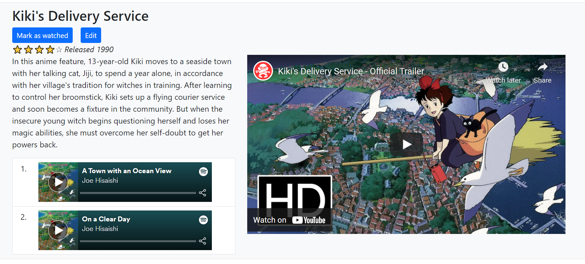
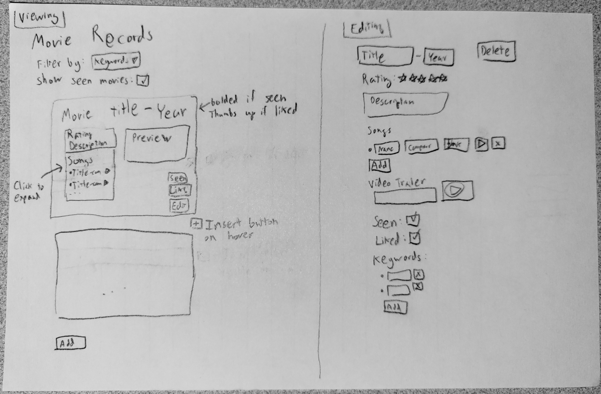

# Full Application

[&laquo; Return to the Chapter Index](index.md)

<details open markdown="block">
  <summary>
    Table of contents
  </summary>
  {: .text-delta }
1. TOC
{:toc}
</details>

Building a real application is difficult. You may understand each piece, but that is not the same as knowing how to glue all the pieces together. Most of the work you do as a software engineer is actually gluing existing components together, in fact. Granted, here we are going to have to make the new components too, and that will be hard too.

The real trick, however, is that all of this becomes easier with good planning. You never just jump into coding without thinking, you really want to follow a process. A simplified version of a more sophisticated process we will eventually show you is as follows:

1. Gather requirements
2. Sketch the application
3. Develop the data model
4. Build a "Minimally Viable" version
5. Iterate

# Movie Records

A client has requested a website where they can record movies that they are interested in watching or have already watched, in order to share with their friends when deciding movie night. Eventually, the website will need a sophisticated backend to persist data long term, but for now they want a simple site that works with some data they have already prepared. Dubbing this application the `Movie Records` site, they have contracted us to make a Minimal Viable version.

You can see the final result of what we produced on this site: [https://frontend-fun.github.io/movie-records/](https://frontend-fun.github.io/movie-records/)



## Gathering Requirements

The first order of business was to meet with the client and discuss what exactly they wanted the application to do. This led to a list of user requirements.

* Users must be able to view a list of movies
* Users can see the title, description, release date, and rating of the movie
* Users should be able to edit movie's attributes
* Users should be able to add a new movie
* Users should be able to remove an existing movie
* Users can indicate if they have seen and/or liked a movie
* Users should be able to quickly play the trailer of the movie
* Users should be able to play some of the movie's soundtrack

We would probably want more detail in this list, and we should also get a better handle on who the users will be and what their specific needs will be. But for now, we will stick to this simple list.

## Sketching the Application

With the requirements in hand, we sat down and made an initial sketch of the Movie Records application's View. This could have been done with software like Figma or PowerPoint, but we used pencil-and-paper (whiteboards are also popular). In some places, we added annotations to highlight interactive components or aspects of the Control that might not be visible.



This initial version incorporated features that we did not end up implementing, like the ability to filter records or to insert movies at arbitrary places. We also did not end up following this exact UI placement for some elements (e.g., the buttons, the editor layout).

However, the value of the sketch is in syncing up the development team and ironing out some important questions in a more concrete way. Another benefit is that this is relatively easy to translate to specific components once we got started on development.

We showed this sketch to the client (making sure to remind them that it was a very rough draft) and made sure they were happy with what they say. They mentioned how some of the features were less important (e.g., filtering, keywords), and that helped convince us to drop them from our minimal viable product.

## Developing the Data Model

Far more important than any actual code is the development of the data model for our application. Remember, the State lives at the heart of all applications - all the control flow exists merely in service of manipulating the state. You should spend time before making components thinking about the state of your application, and where that state lives.

"Where the State lives" in React means, what components need to call `useState`, so that the relevant state variables and state setters can be passed down to the children who need them. Your goal is to keep the state high enough up in the hierarchy that everyone has access who needs it, without going higher than necessary. Unfortunately, that often means that the highest component (which might be `App`, but might be some other specialized component like `MovieRecords` or `MovieApp` that lives in `App`) will contain a signficant amount of State. That State might only be in a single data structure (an Array, Object, or Record), but will still represent most of the data for the application.

Here were our initial thoughts on the State:

* At the top-level, there is an array of movies
* Each movie has a title, release year, description, rating, and a unique ID
* Each movie has an array of songs
* A song has a name, who made the song, and a unique ID
* Each movie can either be seen or unseen, liked or not liked, and we wanted to track when that information changes

These thoughts about the state led us to the following three Interfaces:

* [Movie](https://github.com/frontend-fun/movie-records/blob/21964cdddb05caec5d7cbf7e24110bd84a191fdc/src/interfaces/movie.ts#L4-L12)
* [Song](https://github.com/frontend-fun/movie-records/blob/21964cdddb05caec5d7cbf7e24110bd84a191fdc/src/interfaces/song.ts#L1-L5)
* [Watch](https://github.com/frontend-fun/movie-records/blob/21964cdddb05caec5d7cbf7e24110bd84a191fdc/src/interfaces/watch.ts#L1-L5)

As part of this process, we also made up some mock data to play with. This ended up being useful for testing our application too.

* [Ghibli Movies Data](https://github.com/frontend-fun/movie-records/blob/21964cdddb05caec5d7cbf7e24110bd84a191fdc/src/data/ghibli_movies.json#L2-L20)

For the unique IDs in our movies, we actually used the ID for the movie's trailer on YouTube. Similarly, for our songs' unique IDs, we used their Spotify ID. This had a huge advantage when it came time to embed the trailers and songs into our webpage. There was a draw-back since we then couldn't edit the trailer video of a Movie in our application (since that uniquely identified the Movie!). Since we were making our own data, we had the freedom to make this choice, but often you will find that data comes pre-equipped with a good unique ID.

Notice that we do not actually store the `Watch` information in our `Movie` records in the example data. This is because we felt that that state was special and different from our movie records. First, that data is not intrinsic to the movie, so it felt inappropriate to keep it directly next to the description and released date. Further, we predict future versions of this application where multiple users will have their own watch records, and the movie records will eventually need to be kept more distinct from that watch data. Planning for the future is a tricky game - its entirely possible we will never end up making a future version, or we'll need to solve a completely different problem, or we'll want a different solution. Still, trying to plan a few steps ahead can pay off. Never let yourself get mired in pre-optimization, though, and remember [YAGNI](https://en.wikipedia.org/wiki/You_aren%27t_gonna_need_it). 

After our application imports data initially, we need to make sure that the final result is a valid `Movie` object according to our interface before we use the data as our initial state. This means we must also include the `watched` attribute with the appropriate object inside. To that end, we had a little bit of logic in our application to handle pre-processing the movie data. Note that we carefully placed this logic OUTSIDE of the component; otherwise it will be unnecessarily recalculated each time our application renders. We only need to run this code once to set up our initial data.

* [Importing raw movie data](https://github.com/frontend-fun/movie-records/blob/21964cdddb05caec5d7cbf7e24110bd84a191fdc/src/App.tsx#L5)
* [Preprocessing Movie Data](https://github.com/frontend-fun/movie-records/blob/21964cdddb05caec5d7cbf7e24110bd84a191fdc/src/App.tsx#L9-L14)
* [Actually loading initial data](https://github.com/frontend-fun/movie-records/blob/21964cdddb05caec5d7cbf7e24110bd84a191fdc/src/App.tsx#L29)

If you look at that last link, when we actually use the initial data post-processing, the line is shockingly simple. We use the `MOVIES` constant as the argument to `useState`. Yet the resulting `movies` state variable represents the vast majority of the data for our application! This can be a little disorienting for folks getting started, but just keep in mind how much data that little state variable is pointing to: multiple levels of nested arrays and objects!

### Rendering the Movie List

Since we have the data for our Movie List, we want to be able to see the Movies. This will let us know if our data is sane, and give us a better idea of what the application should look like. In the `App` component, we instantiated the `MovieList` component.

* [Instantiating the `MovieList`](https://github.com/frontend-fun/movie-records/blob/21964cdddb05caec5d7cbf7e24110bd84a191fdc/src/App.tsx#L69-L74)
* [Defining the `MovieList` component](https://github.com/frontend-fun/movie-records/blob/main/src/components/MovieList.tsx)

The `MovieList` component is really just responsible for calling `map` on the movies in order to in turn build up a whole stack of `MovieView` components. Notice how much we have to pass around state and setters, even though this component isn't using the state and setters themselves very much!

The `MovieView` component has a lot going on inside of it, hinting at all the future work that it will do. But it actually started off quite small. Looking carefully through the earlier version, you'll see that we basically were just trying to render all the fields and not worry about anything else.

* [Early version of the `MovieView` component](https://github.com/frontend-fun/movie-records/blob/592b0ec4d2fb6a4e39c48f1a7134afaeda5bc30a/src/components/MovieView.tsx#L8-L27)
* [Final version of the `MovieView` component](https://github.com/frontend-fun/movie-records/blob/main/src/components/MovieList.tsx)

In both the earlier version and the final version, one of the most important things we do is to show the `title`, `release`, and `description` fields.

* [Showing the title](https://github.com/frontend-fun/movie-records/blob/21964cdddb05caec5d7cbf7e24110bd84a191fdc/src/components/MovieView.tsx#L39)
* [Showing the released date](https://github.com/frontend-fun/movie-records/blob/21964cdddb05caec5d7cbf7e24110bd84a191fdc/src/components/MovieView.tsx#L48)
* [Showing the description](https://github.com/frontend-fun/movie-records/blob/21964cdddb05caec5d7cbf7e24110bd84a191fdc/src/components/MovieView.tsx#L53)

However, you can see that there are also some more complicated components, like the Ratings and the SongList. Let's take a closer look at how we developed each one.

### Rendering the Ratings

We wanted a fun visual to show off the ratings of movies, instead of just a raw number. The ratings originally came from IMDB, which operated on a 10-point scale. We converted the scale to a 5-star rating using a little math (divide by two, round up). Then, we create two strings of either filled stars or empty stars based on the calculated rating, using the built-in [`repeat`](https://developer.mozilla.org/en-US/docs/Web/JavaScript/Reference/Global_Objects/String/repeat) method of strings. The final component may look flashy, but the component is less complex than some of the later ones.

* [The `MovieRating` component](https://github.com/frontend-fun/movie-records/blob/21964cdddb05caec5d7cbf7e24110bd84a191fdc/src/components/MovieRating.tsx#L3-L13)

### Rendering the Song List

On the other hand, the logic needed for the `SongList` is quite complicated. In fact, the logic mirrors what we needed to do for the `MovieList` component. The `SongList` component is largely just responsible for using `map` to render the list of songs, delegating most of the actual work for rendering each song to a child component `PlaySong`.

This time, instead of a `Stack` component from Bootstrap, we use the `ListGroup` component (you can learn more about ListGroup from [React Bootstrap's documentation](https://react-bootstrap.github.io/components/list-group/)). The design of the user interface is complex, and not something we can really explain here. But you should know that we had a lot of options, and there are many right answers for how to lay out the user interface of the application!

* [The `SongList` component](https://github.com/frontend-fun/movie-records/blob/21964cdddb05caec5d7cbf7e24110bd84a191fdc/src/components/SongList.tsx#L6-L20)

Our final version of the `PlaySong` component relies on an HTML `iframe` to embed Spotify content into our application. Although a little complicated, the end result is fully playable versions of our songs. Recall that we used the Spotify ID as the unique ID for each song, so we can just interpolate (insert) the `song.id` into the appropriate URL that Spotify provides developers. We use the same trick with the `MovieTrailer` component.

* [The `PlaySong` component](https://github.com/frontend-fun/movie-records/blob/6033ebaa10c97f8d77823a95d812e4031e952757/src/components/PlaySong.tsx#L4-L15)
* [The `MovieTrailer` component](https://github.com/frontend-fun/movie-records/blob/main/src/components/MovieTrailer.tsx#L3-L15)

At an earlier point, we were actually just rendering out the text of the song's name and composer. You can see that simpler component below, which takes advantage of some Bootstrap classes to make the layout a little prettier. You can learn more about the classes we used in Bootstrap's [Spacing](https://getbootstrap.com/docs/5.1/utilities/spacing/) and [Text](https://getbootstrap.com/docs/5.1/utilities/text/) docs.

```tsx
export function PlaySong({ song }: { song: Song }): JSX.Element {
  return <div className="ms-2 me-auto">
            <div className="fw-bold">{song.name}</div>
            {song.by}
          </div>;
}
```

### Viewing the App

Throughout all of this development, we were running the site almost constantly. We wanted a working site at all times, so that we could get quick feedback on whether any individual change is working. Never write huge amounts of code without verifying that the code works. A classic beginner mistake is to "finish" the site without actually running it - you will often find that your work has only just begun, since now you must debug everything.

Criticizing our own workflow, we could have been more consistent about making small, regular commits. The history shown on GitHub does not do justice to the amount of deleting and experimenting that we did along the way. Commiting regularly requires discipline, and may feel slow, but usually pays off when you are working in a large team.

Normally, at this point, we would write some tests to verify that our site loads and displays the correct information, without us needing to actually run and test the site by hand. Unfortunately, we're short on time in developing this chapter, so have to move on to the interactive features.

### Messing with State

We ended up creating several helper functions to streamline how we manipulated the movies' state. Notice how these functions are implemented as a closure over `movies` and `setMovies` (the variables are used inside the nested functions since they are availabel from the enclosing scope). An alternative approach would have been to define helper functions that live in their own separate file (similar to what we did for `arrays.ts`, `objects.ts`, and `nested.ts`), which would require us to pass around `movies` and `setMovies` to any component that wished to use them. There are advantages to providing a reduced interface, but also tradeoffs to keeping code localized to where the code is needed - you have to make think about performance and readability of your code.

* [State Setter Helper Functions](https://github.com/frontend-fun/movie-records/blob/21964cdddb05caec5d7cbf7e24110bd84a191fdc/src/App.tsx#L32-L60)

A common trick when you have a lot of helper functions is to define a special object that can hold the methods. We will see more sophisticated versions of this if we ever get to finish the bonus chapter on `useReduce`. But for now, know that there are tricks to consolidate the number of helper functions that have to be passed around into a single object.

### Watching a Movie

The first bit of interactivity was relatively simple: we wanted to let users click buttons to indicate that they have watched and/or liked a movie. We started with our previously-mentioned helper functions up in `App` (since that was where we defined `setMovies`). Eventually, we used those helper functions in a new component named `RecordControls` (because it lets us "control" the "movie records", not because we were recording - perhaps not a great component name if we need to explain it!).

* [The `setMovieWatched` function](https://github.com/frontend-fun/movie-records/blob/6033ebaa10c97f8d77823a95d812e4031e952757/src/App.tsx#L32-L39) for updating a specific movie in the list, which depends directly on
* [The `watchMovie` function](https://github.com/frontend-fun/movie-records/blob/6033ebaa10c97f8d77823a95d812e4031e952757/src/App.tsx#L16-L26) which creates a new version of a movie based on the old version immutably, changing the state of fields within its `watched` field

The `new Date().toLocaleString()` expression is used to get the current date and time as a pretty string. Although we store this data, we never actually ended up using it in our app. Premature optimization has made fools of us!

```tsx
console.log(new Date().toLocaleString());
```

Only the `setMovieWatched` function needed to be passed down the component hierarchy, because the `watchMovie` is already safely embedded inside of it. However, that still means we are passing `setMovieWatched` down quite a few levels. You can observe how the Props of `MovieList` and `MovieView` component swell up with all these helper functions, when we really just wanted to pass it down to 

* [The `setMovieWatched` prop for `MovieList`](https://github.com/frontend-fun/movie-records/blob/6033ebaa10c97f8d77823a95d812e4031e952757/src/components/MovieList.tsx#L15) being used in [the instantiation for `MovieView`](https://github.com/frontend-fun/movie-records/blob/6033ebaa10c97f8d77823a95d812e4031e952757/src/components/MovieList.tsx#L25)
* [The `setMovieWatched` prop for `MovieView`](https://github.com/frontend-fun/movie-records/blob/6033ebaa10c97f8d77823a95d812e4031e952757/src/components/MovieView.tsx#L20) being used in [the instantiation for `RecordControls`](https://github.com/frontend-fun/movie-records/blob/6033ebaa10c97f8d77823a95d812e4031e952757/src/components/MovieView.tsx#L41)

Once we reach the level where we instantiate our new `RecordControls`, we do something curious: we create an anonymous function (lambda) based on our `setMovieWatched` function. This anonymous function performs a trick called ["partial function application"](https://en.wikipedia.org/wiki/Partial_application). The idea sounds complicated, but the goal is to make life easier later on: we no longer need to pass in the `movie` or `movie.id` to `RecordControls`, just the `setMovieWatched` function on its own. You will sometimes hear this referred to as "binding" or "fixing" a parameter to the function.

Along with the `setMovieWatched`, we also need to provide the current `movie.watched` value, so the current state can be rendered. We'll talk about the `changeEditing` parameter in the next subsection.

Taking a look at the `RecordControls` component, things seem pretty messy. We have two buttons to render, but two of the buttons are slightly different depending on the `seen` and `liked` fields. The code becomes a bit easier to read when you see that we are really just wrapping each button's possible version in a ternary. This would have been a good chance to make a more general purpose helper component, in fact, to decompose the work being done in this component and make the code more readable. Each button is basically the same, if you study them closely.

* [The Watched/Unwatched button](https://github.com/frontend-fun/movie-records/blob/6033ebaa10c97f8d77823a95d812e4031e952757/src/components/RecordControls.tsx#L16-L32)
* [The Like/Not Liked button](https://github.com/frontend-fun/movie-records/blob/6033ebaa10c97f8d77823a95d812e4031e952757/src/components/RecordControls.tsx#L33-L52)

Think carefully about how we started with the State and Controllers at the top of the heirarchy, passed the data down through the components, and then finally wrote most of the View in the bottom-most component. This is not necessarily ideal - the whole goal of components is to centralize the necessary State, Controllers, and View right where they are most needed. Still, this is still much better than if we tried to dump everything in `App`.

### Editing a Movie

The next bit of interactivity is for users to be able to edit the title, description, rating, and release year of each movie. Each of these attributes will eventually correspond to its own Form:

* Textbox for the title, 
* Textarea for the description, 
* Dropdown for the rating, and 
* Number box for the release year

However, the user should not see these Forms all the time, only when they are in "editing mode". Each movie requires its own unique state to determine whether the movie is being edited. And fortunately, this state does not need to be used outside of the Movie's personal `MovieView` component. That means we can keep the state inside of `MovieView`, without needing to lift the state up further. Therefore, we define `editing` and `setEditing` from `useState` inside of `MovieView`, along with a helper state setter function `changeEditing` that inverts the current state of `editing`.

* [The `editing` state variable and `setEditing` state setter in `MovieView`](https://github.com/frontend-fun/movie-records/blob/6033ebaa10c97f8d77823a95d812e4031e952757/src/components/MovieView.tsx#L22)
* [The `changeEditing` helper function in `MovieView`](https://github.com/frontend-fun/movie-records/blob/6033ebaa10c97f8d77823a95d812e4031e952757/src/components/MovieView.tsx#L24-L26)

The `editing` state variable controls whether we render the regular `MovieView` component with its nice human-friendly content, or the `MovieEditor` component. The `MovieEditor` component nicely encapsulates a lot of forms, and it probably would have been a good idea to do the same thing for the "regular" `MovieView` content: move that content into a separate helper component (perhaps `MovieContent`) so that `MovieView`'s only job was to conditionally render `MovieEditor` or this new `MovieContent` component.

* [`editing` as the conditional for the `MovieView`'s ternary](https://github.com/frontend-fun/movie-records/blob/6033ebaa10c97f8d77823a95d812e4031e952757/src/components/MovieView.tsx#L28)

The `MovieEditor` component is a long component that contains all the forms for editing the attributes of the `Movie` object. The Forms do not edit the main `movies` state directly: they instead manipulate local state variables that correspond to the eventual fields in the `movies` state variable. This "temporary" state is useful since users can write whatever they want, and then cancel their changes harmlessly. However, many applications will directly manipulate the data, which requires slightly different `onChange` bindings.

* [The four state variables for `MovieEditor`](https://github.com/frontend-fun/movie-records/blob/6033ebaa10c97f8d77823a95d812e4031e952757/src/components/MovieEditor.tsx#L17-L24)
* [Textbox for the title](https://github.com/frontend-fun/movie-records/blob/6033ebaa10c97f8d77823a95d812e4031e952757/src/components/MovieEditor.tsx#L45-L58) 
* [Number box for the releaseYear](https://github.com/frontend-fun/movie-records/blob/6033ebaa10c97f8d77823a95d812e4031e952757/src/components/MovieEditor.tsx#L59-L73)
* [Dropdown for the rating](https://github.com/frontend-fun/movie-records/blob/6033ebaa10c97f8d77823a95d812e4031e952757/src/components/MovieEditor.tsx#L74-L94)
* [Textarea for the description](https://github.com/frontend-fun/movie-records/blob/6033ebaa10c97f8d77823a95d812e4031e952757/src/components/MovieEditor.tsx#L95-L110)

In order to activate and deactivate Edit Mode, we have buttons that call the `changeEditing` function. Whether we are in Edit Mode or not, we need to provide a button to switch modes (otherwise we'll be trapped in one of the modes). The button to enter Edit mode is in `RecordControls`, and the buttons to escape Edit Mode are in `MovieEditor`. The escape buttons are broken up into Save and Cancel buttons; that way the user can abort making changes if they want.

* [The Edit button in `RecordControls`](https://github.com/frontend-fun/movie-records/blob/6033ebaa10c97f8d77823a95d812e4031e952757/src/components/RecordControls.tsx#L53-L55)
* [The Save/Cancel buttons in `MovieEditor`](https://github.com/frontend-fun/movie-records/blob/6033ebaa10c97f8d77823a95d812e4031e952757/src/components/MovieEditor.tsx#L113-L126)
* [The `save` function for updating the movie](https://github.com/frontend-fun/movie-records/blob/6033ebaa10c97f8d77823a95d812e4031e952757/src/components/MovieEditor.tsx#L26-L35)

Ultimately, we also need a way to update the specific movie in the main `movies` state variable. Back in `App`, we defined an `editMovie` helper function that wraps `setMovies` and uses the `map` function to conditionally replace the `newMovie` we created.

* [The `editMovie` helper function](https://github.com/frontend-fun/movie-records/blob/6033ebaa10c97f8d77823a95d812e4031e952757/src/App.tsx#L41-L47)

### Editing a Song

The Movie's soundtrack is a little more complicated to edit, since there are a list of songs for each movie. However, the model is largely the same as what we've seen before. We begin by declaring some state for the temporary `soundtrack`, at the `MovieEditor` level so we have access to `soundtrack` inside of the `save` helper function we described previously. We also need to instantiate the `SoundtrackEditor` component and provide the state.

* [The `soundtrack` and `setSoundtrack` state in `MovieEditor`](https://github.com/frontend-fun/movie-records/blob/aa04610af1d535a882b0288e5751c17982e68870/src/components/MovieEditor.tsx#L26)
* [The use of `soundtrack` in `save`](https://github.com/frontend-fun/movie-records/blob/aa04610af1d535a882b0288e5751c17982e68870/src/components/MovieEditor.tsx#L35)
* [Instantiation of `SoundtrackEditor` with `soundtrack` and `setSoundtrack`](https://github.com/frontend-fun/movie-records/blob/aa04610af1d535a882b0288e5751c17982e68870/src/components/MovieEditor.tsx#L115-L118)

We wrote `SoundtrackEditor.tsx` a little differently than some of the other components, to highlight some of the variation possible. Specifically, the file contains not only the `SoundtrackEditor` component, but also two helper components named `SongByEditor` and `SongNameEditor`. Usually, each component lives in a separate file, but some folks also believe it's reasonable to place components near each other if there's a strong relationship between them. And in this case, the `SongNameEditor` and `SongByEditor` are being exclusively used by the `SoundtrackEditor` component.

The main responsibility of the `SoundtrackEditor` component is to render the song list (using a `ListGroup` and `map`), with each individual `Song` rendered as the two helper components (`SongNameEditor` and `SongByEditor`) inside of a `div`. Each component is just a textbox, and require the same props, so we encapsulated the type definition of those props into a new interface named `SongProps`. Both components depend on a helper function named `setSong` that updates a given song based on its `id` field using the provided `newSong` parameter.

* [The body of the `SoundtrackEditor` component](https://github.com/frontend-fun/movie-records/blob/aa04610af1d535a882b0288e5751c17982e68870/src/components/SoundtrackEditor.tsx#L50-L71)
* [The `SongProps` interface](https://github.com/frontend-fun/movie-records/blob/aa04610af1d535a882b0288e5751c17982e68870/src/components/SoundtrackEditor.tsx#L5-L8)
* [The `SongNameEditor` component](https://github.com/frontend-fun/movie-records/blob/aa04610af1d535a882b0288e5751c17982e68870/src/components/SoundtrackEditor.tsx#L10-L22)
* [The `SongByEditor` component](https://github.com/frontend-fun/movie-records/blob/aa04610af1d535a882b0288e5751c17982e68870/src/components/SoundtrackEditor.tsx#L24-L36)
* [The `setSong` helper function](https://github.com/frontend-fun/movie-records/blob/aa04610af1d535a882b0288e5751c17982e68870/src/components/SoundtrackEditor.tsx#L45-L47)

### Deleting a Movie

Deleting a Movie only requires a new helper function and a new button in `MovieEditor`. 

* [The `deleteMovie` helper function in `App`](https://github.com/frontend-fun/movie-records/blob/6033ebaa10c97f8d77823a95d812e4031e952757/src/App.tsx#L49-L51)
* [The Delete Movie button in `MovieEditor`](https://github.com/frontend-fun/movie-records/blob/6033ebaa10c97f8d77823a95d812e4031e952757/src/components/MovieEditor.tsx#L120-L126)

### Adding a Movie

Unfortunately, adding a new movie is much more complex. The user *must* specify the ID of the Movie and the IDs of all the Songs. Otherwise, we cannot insert them into the list. A full version of the application would probably allow the user to write the other fields, but our minimal version only needs the IDs, so that is all we will require from the user.

We put the Forms for prompting the user about a new movie inside a Modal dialog box (popup) to keep things a little more organized. This requires an additional bit of state (`showAddModal`) at the `App` level to determine whether or not the Modal should be currently visible.

* [State for the Modal's visibility](https://github.com/frontend-fun/movie-records/blob/6033ebaa10c97f8d77823a95d812e4031e952757/src/App.tsx#L30)
* [Helper functions for the Modal](https://github.com/frontend-fun/movie-records/blob/21964cdddb05caec5d7cbf7e24110bd84a191fdc/src/App.tsx#L62-L63)
* [Launch button for the Modal, and the Modal's instantiation](https://github.com/frontend-fun/movie-records/blob/21964cdddb05caec5d7cbf7e24110bd84a191fdc/src/App.tsx#L76-L89)
* [The actual Modal Component](https://github.com/frontend-fun/movie-records/blob/main/src/components/AddMovieModal.tsx)
* [The React Bootstrap Docs on using a Modal](https://react-bootstrap.github.io/components/modal/)

The fact that we have the `AddMovieModal` outside of the `MovieList` explains why our `movies` state variable was declared in `App`. Both of these components are direct children of `App`, and both components needed access to the state setter `setMovie` (albeit indirectly through their respective helper functions). Therefore, the state needed to be lifted very high to reach down to both.

The [`saveChanges`](https://github.com/frontend-fun/movie-records/blob/6033ebaa10c97f8d77823a95d812e4031e952757/src/components/AddMovieModal.tsx#L19-L36) function is really crying out to become a helper function. Although that would not save us much code, the readability would be dramatically improved, and we could unit test that functionality more easily.

The Movie's ID field is just a textbox, since there is just one. However, we must be more careful with the song list, since we are trying to get a list of data. We rely on a new component named `EditableSongList`.

* [Textbox for Movie's ID](https://github.com/frontend-fun/movie-records/blob/6033ebaa10c97f8d77823a95d812e4031e952757/src/components/AddMovieModal.tsx#L44-L57)
* [Instantiation for `EditableSongList`](https://github.com/frontend-fun/movie-records/blob/6033ebaa10c97f8d77823a95d812e4031e952757/src/components/AddMovieModal.tsx#L58-L63)

The `EditableSongList` component has several parts and depends on state created in `AddMovieModal` (the `songs` and `setSongs` state).

* [The song helper functions](https://github.com/frontend-fun/movie-records/blob/6033ebaa10c97f8d77823a95d812e4031e952757/src/components/EditableSongList.tsx#L11-L25)
* [The button for adding a song](https://github.com/frontend-fun/movie-records/blob/6033ebaa10c97f8d77823a95d812e4031e952757/src/components/EditableSongList.tsx#L29-L31)
* [The textbox for editing the song's ID](https://github.com/frontend-fun/movie-records/blob/6033ebaa10c97f8d77823a95d812e4031e952757/src/components/EditableSongList.tsx#L40-L50)
* [The button for deleting a song](https://github.com/frontend-fun/movie-records/blob/6033ebaa10c97f8d77823a95d812e4031e952757/src/components/EditableSongList.tsx#L51-L59)

## Testing the Application

We haven't written any tests for this codebase yet. There's no reason other than lack of time. Again, you should really be testing this application consistently throughout. Certainly, before we declare victory, we really should write some tests. Some example ideas that we will do when we have more time:

* Does the page render the movies at all with all of the expected information?
* Can we edit a movie's name? Its description? Etc.
* Can we delete a movie?
* Can we add a movie with several songs?
* Can we add a movie, delete that movie, and a new different movie?
* Can we edit a song's name?

## Iterate

At this point, we have enough of a website that we should definitely show this version to a human. In fact, most likely, we should have been showing even earlier versions to the client throughout. For now, we are simply trying to get some practice in developing web applications, so we're relaxing our usual process a lot. In the next chapter, we'll talk more about the best practices for developing software in a maintainable way that leads to a successful product.

As we mentioned earlier, the example shown here may look like a straightforward line of development from A to B. However, the reality is that we kept changing things and undoing things. Programming is a messy process, and we often make mistakes: we don't realize that some state needs to be higher, or that a helper function needed another parameter, or a Component could be broken up in several places. At least, not at first - these are easier things to realize after you've written them.

One of our last pieces of advice is to keep your codebase as clean as possible as long as you can. Cutting corners, abusing state, and not thinking about how to break things up may often seem convenient. But you pay the "technical debt" you accumulate at some point - often near the end of the development, when you encounter bugs or issues and you can't fix them because you chose poor variable names or aren't decomposing.

# 📝 Task - Quizzer

The task for this chapter is very different from previous ones. Up until now, we had the expectation that you would be able to achieve every subtask we set out, and that you would not proceed without finishing each part. However, that expectation might be unrealistic for this Task since we are establishing a lot of potential critiera. Your grade will be influenced by the amount of criteria that you complete, but we do not really expect you to finish all of the task 100%. Use this opportunity to learn what you can about writing a larger application!

Our goal is to have you walk through the same process we did in developing the Movie Records, but instead developing an application for quizzes (both academic ones and fun trivia ones). We have already created a list of user requirements below. However, we have not sketched the application, started any of the development, or written you any tests. These are all things that we want YOU to do.

## Create the Branch

We begin by having you checkout the `solved-forms` branch, so that we can then branch off into a new fresh branch.

```sh
$> git checkout solved-forms
$> git pull upstream main
$> git fetch upstream task-quizzer
$> git checkout -b solved-quizzer
$> git merge upstream/task-quizzer
```

You will find that we have provided VERY little code. It's really just the `quizzer` folder, the `quizzer/Quizzer.tsx` file, and the `quizzer/Quizzer.test.tsx` file. We expect you to add more files in order to achieve the final result.

## Task Requirements

Here is our set of user requirements that we have solicited from our client.

* Users can see a list of quizzes, including the quizzes title, description, and how many questions it has
* Users can select a specific quiz to see the questions, including the question's name, body, and points
* Quiz questions can be of AT LEAST two types: a short answer question or multiple choice question
* Users can enter or choose an answer for a quiz question, and be told if they are correct
* Users can see how many total points they have earned
* Users can clear out their existing answers for a quiz
* Users can publish or unpublish a question
* Users can filter the questions in a list so that only published questions are shown
* Users can edit the questions and fields of a quiz
* Users can add a new quiz question
* Users can delete an existing quiz question
* Users can reorder quiz questions
* Users can add a new quiz
* Users can delete an existing quiz

If you need clarification for a requirement, you can ask the client. But in general, the policy is that if the requirement is vague or behavior is not required, you should feel free to make the call on this. The goal is to get you practice making a larger-scale application, not to make a real piece of software. For now!

## First Steps

Going through our advice again, you will hopefully see the general flow of how we worked:

1. Gather requirements
2. Sketch the application
3. Develop the data model
4. Develop some test data
5. Build a "Minimally Viable" version
   1. Get the data to render
   2. Add interactivity

We strongly urge you to proceed in this fashion. Part of our grading will be to look at your sketch and data model!

## Grading

Given the open-ended nature of this application, you are being graded by a rubric. Completing more requirements will tend to get you more points, but so will writing tests. You also earn points for things like sketching the application and making up test data.

Everyone will feel comfortable completing a different number of requirements, and have different amounts of time they can commit. We understand how this can be stressful and we appreciate your flexibility in approaching this activity the right way. Recognize that you can pass the course even if you are struggling to get started - you will be getting another attempt when we get to he Final Project, and there you will explicitly have a team, so things are likely to go more smoothly.

## Submission

Soon, we will want to review your application so that we can make decisions about team assignments. Do not delay in submitting for this Task - as soon as you have started, deploy your application and submit on Canvas.

```sh
$> git push --set-upstream origin solved-components
```

As you make more changes, add and commit regularly. Every now and then, you can push your changes (no longer needing to specify the upstream):

```sh
$> git push
```

Failure to submit this assignment tells us something about your preparation for the Final Project. There will be more time before the Final Project begins to work on this Task, but do not prevent us from viewing your application!

## Creative Freedom

You have a LOT of freedom to make the Quizzer look the way you want. Colors, spacing, specific features - we want to see folks have fun and build something they feel they can own.

Work together, show people your design, and avoid living in a vaccuum. Make a fun trivia quiz to show to your classmate and have them try out your application! Make the entire application dog-themed! The sky is the limit, as long as it meets the general requirements we specified before.
