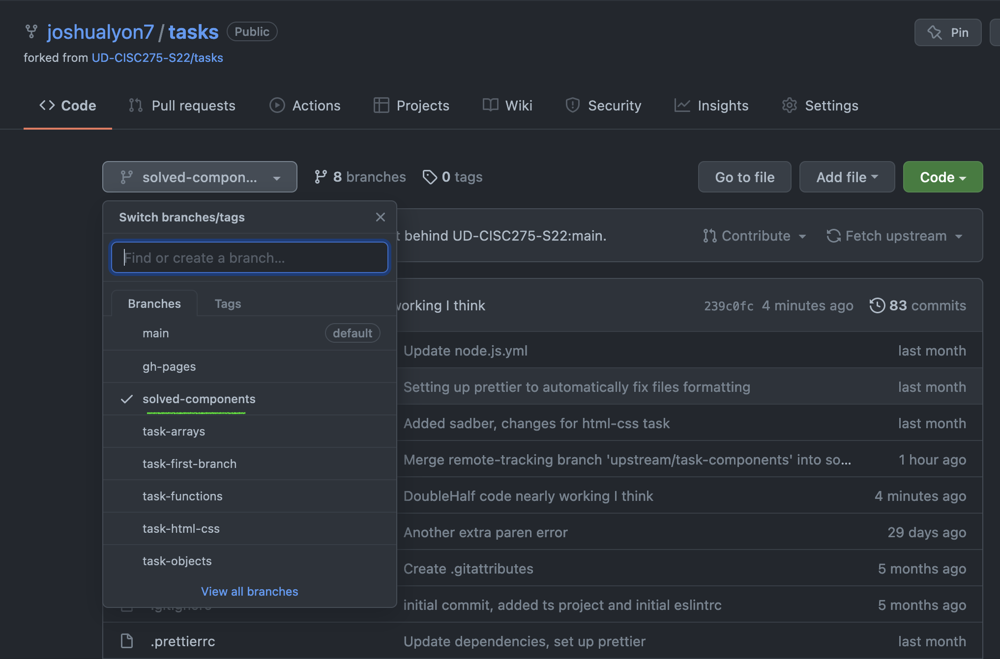
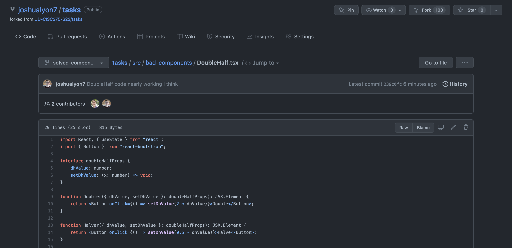
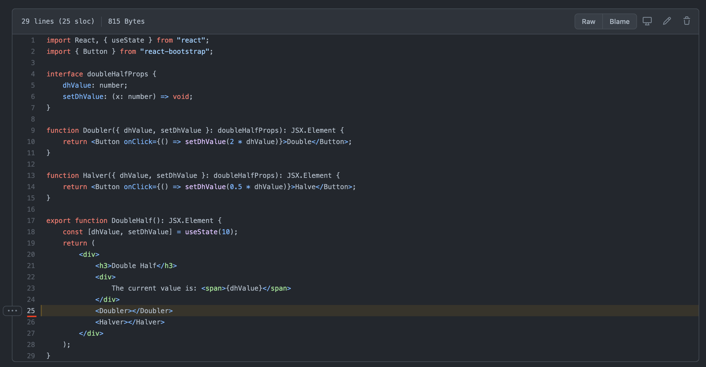
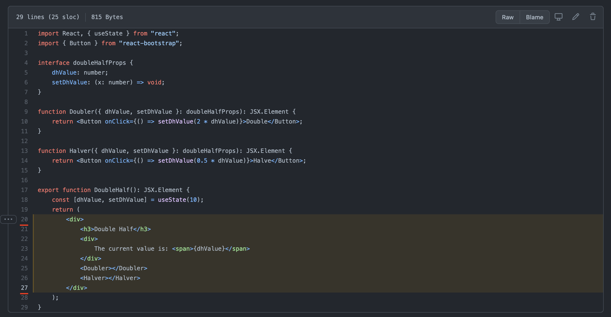
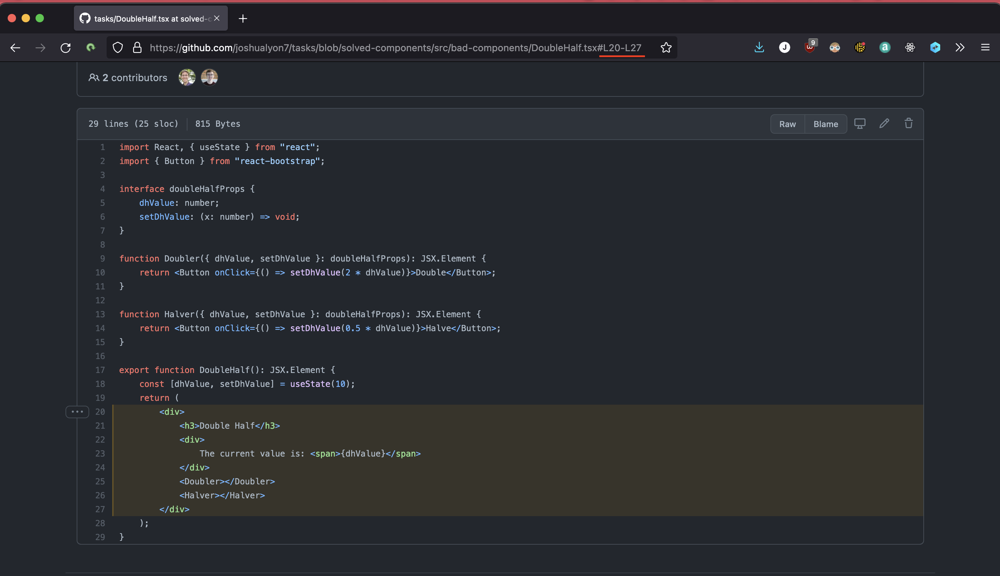

[&laquo; Return to The Lost Chapters](index.md)

<details open markdown="block">
  <summary>
    Table of contents
  </summary>
  {: .text-delta }
1. TOC
{:toc}
</details>

# Sharing Code

Often when working on a project, you'll want to get another set of eyes on your code. It might be tempting to send over a screenshot or, heaven forbid, *take a picture of your screen with your phone* 🤮. Don't do this! It's much better to push your work to your repo and send a link to your collaborator. 

Here's how to do that:

## Push your in-progress code
Start by pushing the current state of your repo to GitHub. If this is the first time pushing to this branch [add](https://git-scm.com/docs/git-add#_examples) and [commit](https://git-scm.com/docs/git-commit#_name) your files, then run: 
```bash
$ git push --set-upstream origin solved-html-css
```
If you've already pushed this branch, after adding and committing you can just run:  
```bash
$ git push
```

## Find the code on GitHub
After you push to your branch, you can find your code by going to your repo on GitHub, navigating to the branch you're working on, and clicking the file you want to share. For instance, if I wanted to share my code for DoubleHalf, I would push the code: 

Then go to the branch on GitHub: 

And navigate to the DoubleHalf file: 


## Link to specific lines
Once you're in the right file, you can point whoever is helping you directly to the right lines by clicking the line you want on the left side of the file in GitHub: 

You can also select multiple lines by shift + clicking a line further down or up the file. This will select the entire range of lines to share. For instance, in the below screenshot I clicked `20`, then shift clicked `27` to select every line between `20` and `27`: 

Once you select the lines you want to share, you can copy the URL of the page you're on and send that wherever you're sharing your code to. As you can see in the screenshot below, the URL has been updated to reflect the lines that you have selected: 

If someone clicks that link, they will be directed to exactly the lines that you have selected. 

Using this method of code sharing should make the lives of everyone around you easier! And remember, **NEVER** take a picture of your screen 😡